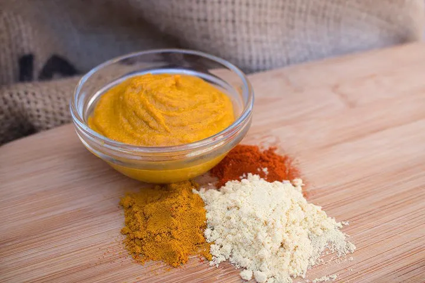

# :hotdog: Classic Mustard

{ loading=lazy }

| :timer_clock: Total Time |
|:-----------------------: |
| 5 minutes |

## :salt: Ingredients

- :droplet: 3 Tbsp (43 g) water
- :wine_glass: 5 Tbsp vinegar
- :chestnut: 0.5 cup mustard powder
- :candy: 1 Tbsp (10 g) sugar
- :salt: 0.25 tsp salt
- :leafy_green: 1 tsp (3 g) turmeric (optional)
- :hot_pepper: 0.5 tsp (2 g) sweet paprika (optional)

## :pencil: Instructions

### Step 1

For mild mustard, combine the water and vinegar and bring to a boil, then mix in mustard powder, sugar, and salt.

### Step 2

Using boiling hot vinegar and water will significantly reduce the nose hit from the mustard powder.

### Step 3

Use cold liquids for hotter mustard. For variations, try substituting a dry white wine or lemon juice in place of the
water.

### Step 4

Mustard seeds/powder can be any type: mild, hot, yellow, or brown. Add whole or crushed mustard seeds after completing
the basic recipe. They adsorb a lot of liquid. If extra liquid is needed, consider using vinegar first.

### Step 5

You can experiment with numerous other spices and flavors. The most popular additions are turmeric (optional) and sweet
paprika (optional).

## :link: Source

- <https://www.thespicehouse.com/blogs/recipes/classic-mustard-recipe>
