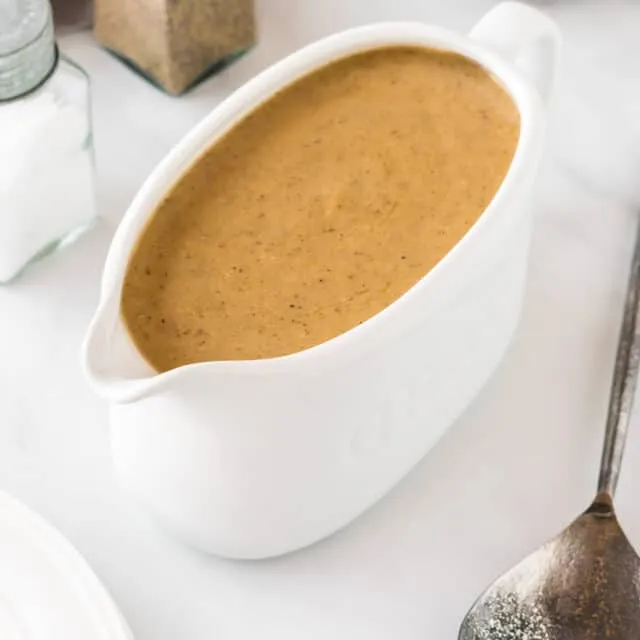

# :bowl_with_spoon: Good Gravy

{ loading=lazy }

| :fork_and_knife_with_plate: Serves | :timer_clock: Total Time |
|:----------------------------------:|:-----------------------: |
| 2.5 cups | 5 minutes |

## :salt: Ingredients

- 2 cups [Vegetable Broth](../../ingredients/vegetable-broth.md)
- :apple: 2.5 Tbsp (36 g) tamari or other soy sauce
- :apple: 1 Tbsp fresh thyme
- :salt: some salt
- :salt: some pepper
- :chestnut: 2 Tbsp (14 g) cornstarch
- :droplet: 3 Tbsp (43 g) water
- :glass_of_milk: 0.25 cup (57 g) milk

## :cooking: Cookware

- 1 small saucepan

## :pencil: Instructions

### Step 1

In a small saucepan, combine the [Vegetable Broth](../../ingredients/vegetable-broth.md), tamari or other soy sauce, fresh thyme, and salt and pepper to taste
and bring to a boil over high heat.

### Step 2

Reduce the heat to low, whisk in the cornstarch, dissolved in 3 Tbsp water, mixture, and boil, whisking until the sauce
thickens, about 1 minute.

### Step 3

Slowly whisk in the milk; do not allow to boil.

### Step 4

Taste to adjust the seasonings. Serve hot.

## :link: Source

- The Vegetarian Meat & Potatoes Cookbook
