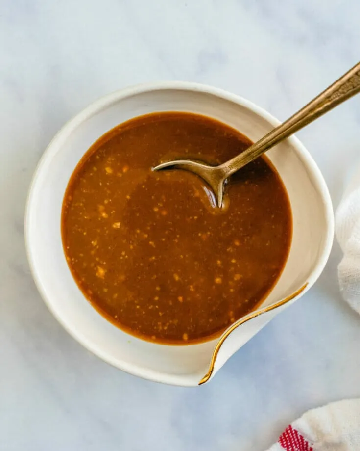

# :ramen: Miso Glaze

{ loading=lazy }

| :timer_clock: Total Time |
|:-----------------------: |
| 5 minutes |

## :salt: Ingredients

- :takeout_box: 1 Tbsp (18 g) yellow miso paste
- :honey_pot: 1 Tbsp (20 g) maple syrup
- :takeout_box: 1 Tbsp tamari
- :wine_glass: 1 tsp rice vinegar or lime juice
- :olive: 1 tsp (5 g) sesame oil

## :cooking: Cookware

- 1 small mixing bowl

## :pencil: Instructions

### Step 1

To a small mixing bowl, add 1 Tbsp yellow miso paste, 1 Tbsp maple syrup, 1 Tbsp tamari, 1 tsp rice vinegar or lime
juice, and 1 tsp sesame oil.

### Step 2

Whisk to combine.

## :link: Source

- <https://minimalistbaker.com/easy-vegan-ramen/#wprm-recipe-container-35499>
