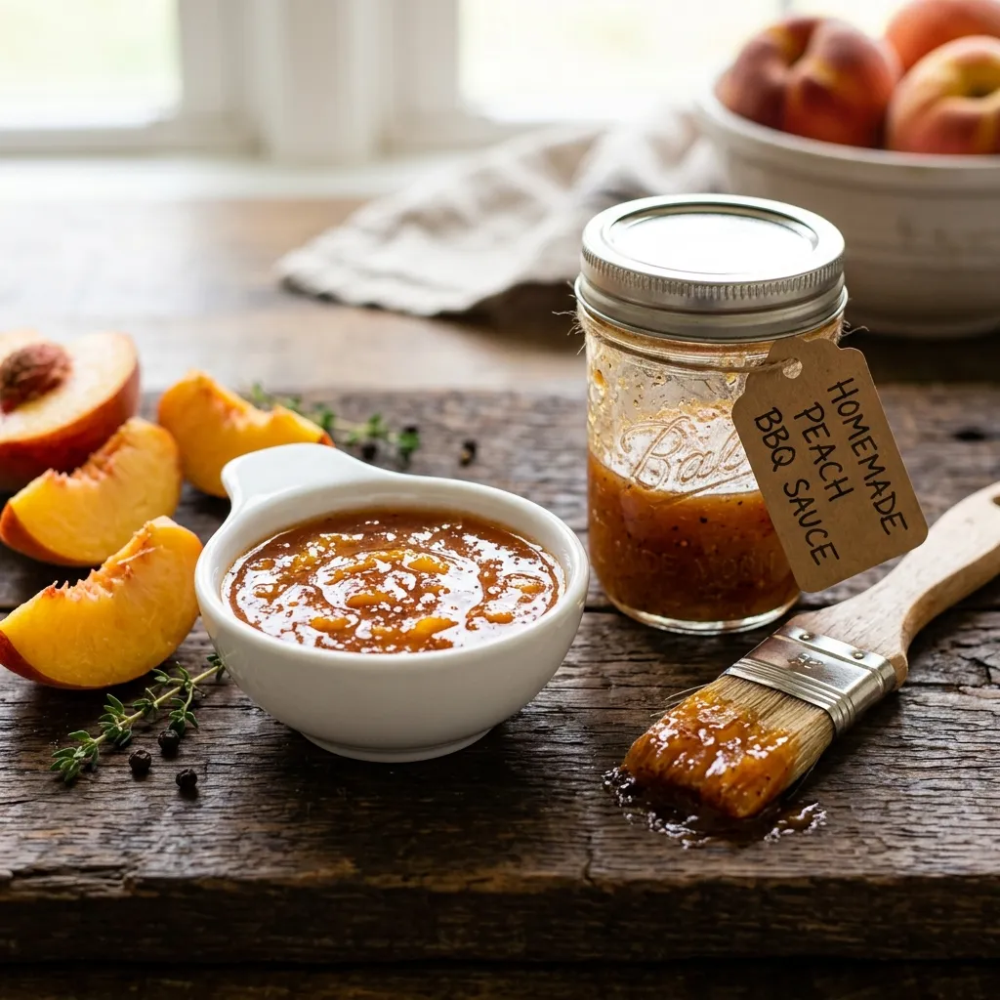

# :peach: Peach BBQ Sauce

{ loading=lazy }

| :timer_clock: Total Time |
|:-----------------------: |
| 30 minutes |

## :salt: Ingredients

- :peach: 1.25 cups (425 g) peach preserves
- :peach: 15 oz (319 g) sliced peaches (drained)
- :butter: 4 Tbsp (56 g) unsalted [butter](../../ingredients/butter/butter.md)
- :onion: 0.5 small onion diced
- :tomato: 1.5 cups ketchup
- :candy: 0.5 cup (114 g) light [brown sugar](../../ingredients/brown-sugar.md)
- :takeout_box: 0.5 cup (170 g) cider vinegar
- :droplet: 0.5 cup (114 g) water
- :takeout_box: 2 Tbsp (28 g) Worcestershire sauce
- :seedling: 2 Tbsp [Dijon mustard](../dijon-mustard.md)
- :salt: 1 tsp salt
- :salt: 2 tsp (7 g) freshly ground black pepper
- :herb: 0.25 tsp (1 g) ground thyme
- :garlic: 1 tsp granulated garlic
- :hot_pepper: 2 tsp (10 g) hot sauce

## :cooking: Cookware

- 1 food processor
- 1 medium saucepan
- 1 jar

## :pencil: Instructions

### Step 1

In a food processor, combine peach preserves and sliced peaches (drained). Blend them to a puree.

### Step 2

In a medium saucepan, melt unsalted [butter](../../ingredients/butter/butter.md) over medium-high heat and
sauté small onion diced until it’s soft, but not browned, 3 to 4 minutes.

### Step 3

Stir in the peach puree, ketchup, light [brown sugar](../../ingredients/brown-sugar.md), cider vinegar, water,
Worcestershire sauce, [Dijon mustard](../dijon-mustard.md), salt, freshly ground black pepper, ground thyme,
granulated garlic, and hot sauce. Lower heat to medium-low and simmer until slightly thickened, 15 to 20 minutes,
stirring frequently.

### Step 4

Let cool, transfer to a jar and store in the refrigerator for up to 3 weeks.

## :link: Source

- <https://www.mercurynews.com/2020/05/11/barbecue-recipe-competition-style-smoked-chicken-thighs/>
