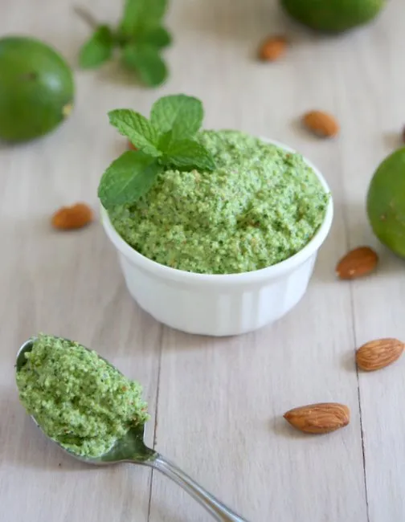

# :herb: Cilantro Almond Pesto

{ loading=lazy }

| :fork_and_knife_with_plate: Serves | :timer_clock: Total Time |
|:----------------------------------:|:-----------------------: |
| 4 | 5 minutes |

## :salt: Ingredients

- :chestnut: 0.5 cup (43 g) almonds
- :herb: 1 cup (42 g) cilantro
- :tangerine: 3 Tbsp (42 g) lemon juice
- :garlic: 1 Tbsp garlic
- :hot_pepper: 0.5 small jalapeño
- :salt: 0.5 tsp salt
- :olive: 0.33 cup (66 g) olive oil

## :cooking: Cookware

- 1 large jar or covered bowl
- 1 food processor

## :pencil: Instructions

### Step 1

In a large jar or covered bowl, add the almonds and enough water to cover. Soak overnight, drain, and rinse.

### Step 2

In a food processor, add the almonds, cilantro, lemon juice, garlic, jalapeño, and salt. Pulse until well blended but
not quite pureed. With the processor running, add the olive oil and process until combined.

## :link: Source

- The Gracias Madre Cookbook
