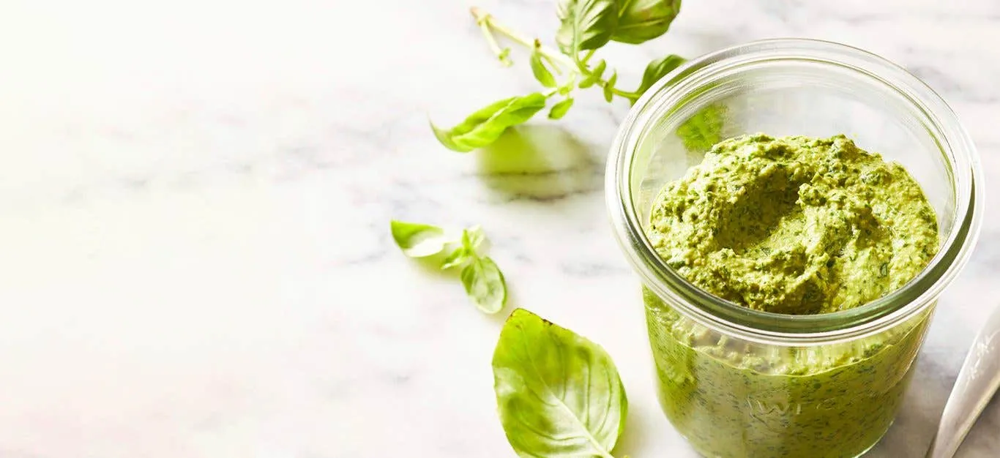

# :herb: Homemade Vegan Pesto Forks Over Knives

{ loading=lazy }

| :timer_clock: Total Time |
|:-----------------------: |
| 45 minutes |

## :salt: Ingredients

- :chestnut: 0.25 cup (28 g) raw cashews
- :herb: 2 cups (84 g) fresh basil (packed)
- :cheese_wedge: 2 Tbsp (8 g) nutritional yeast
- :garlic: 3 cloves garlic (roughly chopped)
- :tangerine: 2 tsp (9 g) lemon juice
- :salt: 0.13 tsp (0.75 g) sea salt
- :baby_bottle: 2 to 4 Tbsp (30 to 60 g) unsweetened unflavored plant milk (almond, soy, cashew, or rice)

## :cooking: Cookware

- :bowl_with_spoon: 1 small bowl
- :gear: 1 food processor

## :pencil: Instructions

### Step 1

Place **raw cashews** (28 g) in a **small bowl** and cover with boiling water. Let soak for 30 to 35 minutes, then drain.

### Step 2

Place the soaked cashews in a **food processor** along with **fresh basil** (80 g), **nutritional yeast** (10 g), **garlic** (15 g), **lemon juice** (10 g), and **sea salt** (0.75 g).

### Step 3

Cover and process until nearly smooth.

### Step 4

While the processor is running, add **unsweetened unflavored plant milk** (30 to 60 g) 1 tablespoon at a time until you reach your desired consistency (it should be spreadable but not runny). Scrape down the sides as needed.

### Step 5

Toss 2 tablespoons of pesto with every 1 cup of hot cooked pasta, or use as a spread.

## :link: Source

- <https://www.forksoverknives.com/recipes/vegan-sauces-condiments/homemade-vegan-pesto/>
