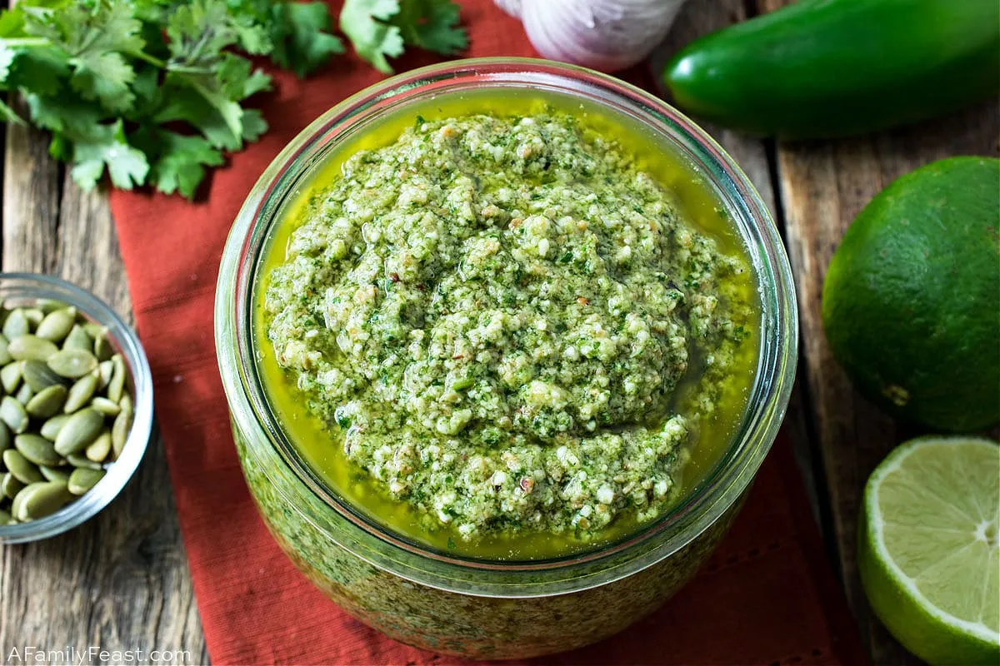

# :herb: Mascarpone Pesto

{ loading=lazy }

| :fork_and_knife_with_plate: Serves | :timer_clock: Total Time |
|:----------------------------------:|:-----------------------: |
| 2 cups | 5 minutes |

## :salt: Ingredients

- :herb: 2 cups parsley
- :glass_of_milk: 1 8-oz container mascarpone cheese
- :chestnut: 0.67 cup (95 g) toasted slivered almonds
- :olive: 0.5 cup (100 g) olive oil
- :apple: 0.25 cup dill
- :wine_glass: 1 Tbsp (9 g) white wine vinegar
- :garlic: 3 cloves garlic
- :salt: 0.25 tsp salt

## :cooking: Cookware

- 1 food processor

## :pencil: Instructions

### Step 1

Combine 2 cups packed fresh parsley; one 8-oz container mascarpone cheese; 2/3 cup toasted slivered almonds; 1/2 cup
extra virgin olive oil; 1/4 cup packed fresh dill; 1 Tbsp white wine vinegar; 2 to 3 cloves garlic, halved; and 1/4 tsp
kosher salt in a food processor.

### Step 2

Process until nearly smooth. Add up to 2 Tbsp additional olive oil to reach desired consistency.

### Step 3

Serve immediately as a dip.

## :link: Source

- Magnolia
