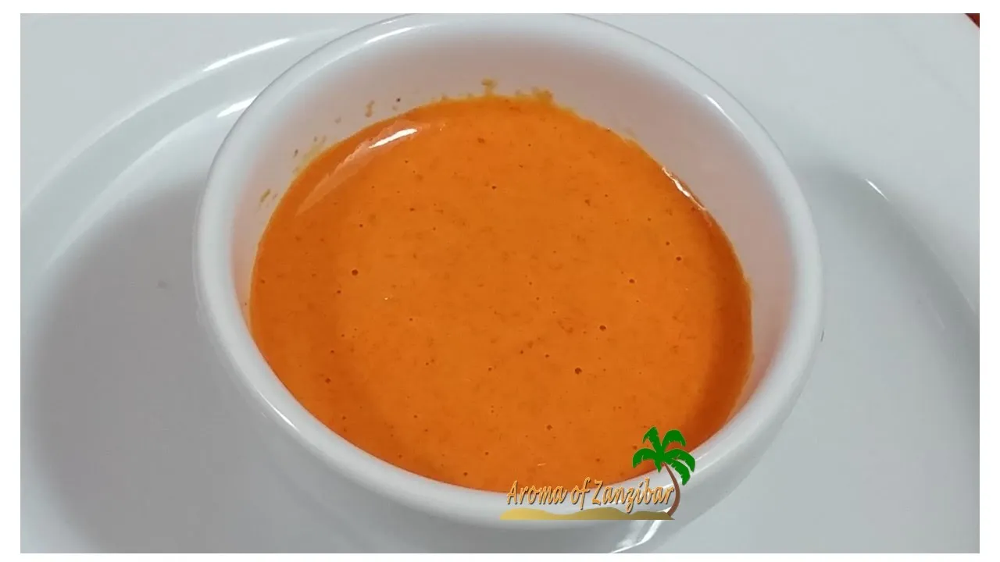

# :bell_pepper: Roasted Red Pepper Coulis

{ loading=lazy }

| :timer_clock: Total Time |
|:-----------------------: |
| 15 minutes |

## :salt: Ingredients

- :olive: 1 Tbsp (12 g) olive oil
- :tea: 1 cup (96 g) onion
- :garlic: 1 Tbsp garlic
- :hot_pepper: 1 24-oz jar [Roasted Red Peppers](../../ingredients/roasted-red-peppers.md)
- :salt: some salt
- :salt: some pepper

## :cooking: Cookware

- 1 saucepan
- 1 immersion blender
- 1 fine sieve or a chinois

## :pencil: Instructions

### Step 1

In a saucepan, heat the olive oil, when hot add the onion and cook until translucent. Add the garlic, and when fragrant
add the [Roasted Red Peppers](../../ingredients/roasted-red-peppers.md) and their juice and cook for 10 to 15 minutes.

### Step 2

With an immersion blender, process until very smooth.

### Step 3

Strain through a fine sieve or a chinois and adjust seasoning with salt and pepper.

## :link: Source

- <https://chefjeanpierre.com/recipes/roasted-bell-pepper-coulis-red-pepper-coulis/>
