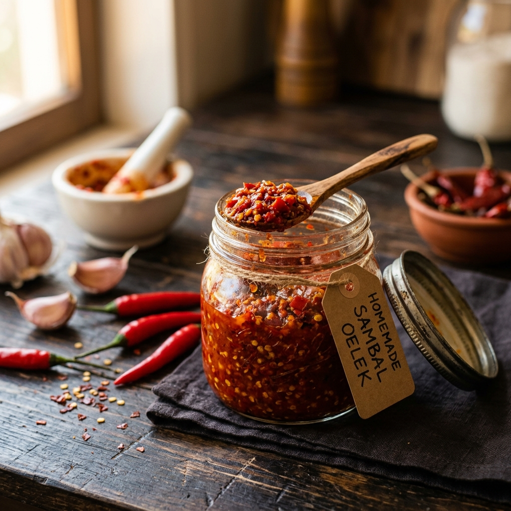

# :hot_pepper: Sambal Oelek

{ loading=lazy }

| :fork_and_knife_with_plate: Serves | :timer_clock: Total Time |
|:----------------------------------:|:-----------------------: |
| 12 | 15 minutes |

## :salt: Ingredients

- :hot_pepper: 1 lb fresh red chili peppers
- :garlic: 2 cloves garlic cloves
- :salt: 1.5 tsp coarse salt
- :wine_glass: 2 Tbsp (4 g) rice vinegar
- :maple_leaf: 1 tsp (4 g) brown sugar

## :cooking: Cookware

- mortar and pestle or food processor
- small saucepan
- glass jar

## :pencil: Instructions

### Step 1

Remove the stems from the **fresh red chili peppers**. You can keep all or some of the seeds depending on your desired heat level. Roughly chop the peppers.

### Step 2

Coarsely grind the chopped chilies, **garlic cloves**, and **coarse salt** in a mortar and pestle, or pulse in a food processor until you get a chunky, textured paste (avoid puréeing it completely).

### Step 3

Stir in the **rice vinegar** and **brown sugar** (if using).

### Step 4

To increase shelf life and help the flavors meld, transfer the paste to a small saucepan and simmer over medium-low heat for 5 to 8 minutes.

### Step 5

Allow the paste to cool completely, then spoon it into a clean, airtight glass jar. Store in the refrigerator.

!!! tip "The Umami Swap"

    Traditional non-vegetarian sambals get their umami from *trassie* (fermented shrimp paste). If you want that deep savory element without using seafood, stir in **1/2 tsp of dark soy sauce**, a splash of **liquid aminos**, or a tiny pinch of **monosodium glutamate (MSG)** during the grinding step.

!!! tip "Serving Ideas"

    Use this as a dipping sauce for vegetable fritters (*bakwan*), stir a spoonful into your *nasi goreng* (fried rice), or use it as a spicy marinade for tofu, tempeh, or roasted vegetables.

## :link: Source

- <https://tashasartisanfoods.com/blog/vegan-sambal-oelek-recipe/>
