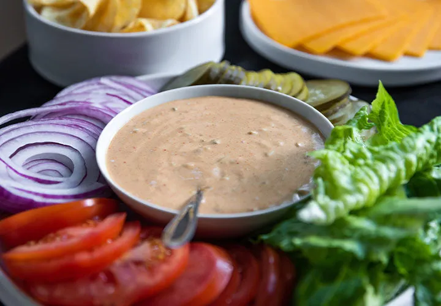

# :hamburger: Special Sauce for Burgers

{ loading=lazy }

| :timer_clock: Total Time |
|:-----------------------: |
| 0 minutes |

## :salt: Ingredients

- 0.5 cup [mayonnaise][1]
- 0.5 cup ketchup
- :seedling: 0.25 cup (39 g) yellow mustard
- :tea: 2 Tbsps sweet pickle relish
- :salt: 0.5 tsp (1 g) white pepper
- :garlic: 0.25 tsp garlic powder
- :hot_pepper: 0.5 tsp Hungarian paprika
- :chestnut: 0.5 tsp (1 g) coriander
- :apple: 1 tsp (6 g) apple cider vinegar
- :apple: 0.5 tsp (2 g) Worcestershire sauce

## :cooking: Cookware

- 1 mixing bowl
- 1 whisk

## :pencil: Instructions

### Step 1

Combine [mayonnaise][1], ketchup, yellow mustard, sweet pickle relish, white pepper, garlic powder, Hungarian paprika,
coriander, apple cider vinegar, and Worcestershire sauce in a mixing bowl and whisk together.

### Step 2

This sauce recipe is created for hamburgers, but it makes a great salad dressing too.

## :link: Source

- <https://www.thespicehouse.com/blogs/recipes/special-sauce-for-burgers>

[1]: <../../sauces-and-dressings/dips-and-spreads/mayonnaise.md>
