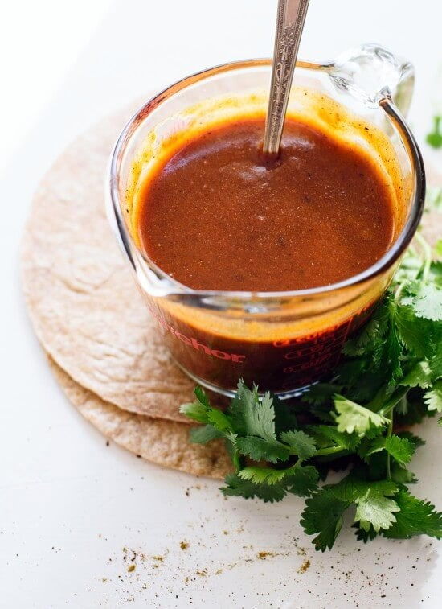

# Thai Red Curry Tofu Marinade

{ loading=lazy }

| :fork_and_knife_with_plate: Serves | :timer_clock: Total Time |
|:----------------------------------:|:-----------------------: |
| 4 | 20 minutes |

## :salt: Ingredients

- :cheese_wedge: 1 block (400 to 450 g) extra firm tofu (14 to 16-ounce)
- :curry: 2 Tbsp (30 g) Thai red curry paste
- :maple_leaf: 1.5 Tbsp (30 g) maple syrup
- :takeout_box: 1 Tbsp (15 g) tamari
- :wine_glass: 1 Tbsp (15 g) rice vinegar
- :oil_drum: 1 tsp (5 g) toasted sesame oil (optional)
- :garlic: 2 large cloves garlic, minced
- :herb: 1 Tbsp (15 g) ginger, minced
- :coconut: 0.25 cup (60 g) coconut milk

## :cooking: Cookware

- :bowl_with_spoon: 1 large bowl
- :package: 1 airtight container
- :cooking: 1 medium skillet

## :pencil: Instructions

### Step 1

Cut the :cheese_wedge: extra firm tofu (14 to 16-ounce) into the desired shape.

### Step 2

In a :bowl_with_spoon: large bowl, whisk together the :curry: Thai red curry paste, :maple_leaf: maple syrup,
:takeout_box: tamari, :wine_glass: rice vinegar, :oil_drum: toasted sesame oil (optional), minced :garlic: garlic, and
minced :herb: ginger.

### Step 3

Transfer the cut tofu to the bowl and toss to coat.

### Step 4

Place the tofu in an :package: airtight container and pour the remaining sauce onto the tofu.

### Step 5

Marinate for at least ~{15%minutes}. Or refrigerate for up to 4 days, or freeze for up to 3 months. Thaw in the
refrigerator before using.

### Step 6

Bake, grill, air fry, or pan fry the tofu. Heat the sauce in a :cooking: medium skillet over medium-low heat. Add the
:coconut: coconut milk to the skillet and whisk until smooth.

## :link: Source

- <https://cookingforpeanuts.com/easy-tofu-marinade-recipes/>
