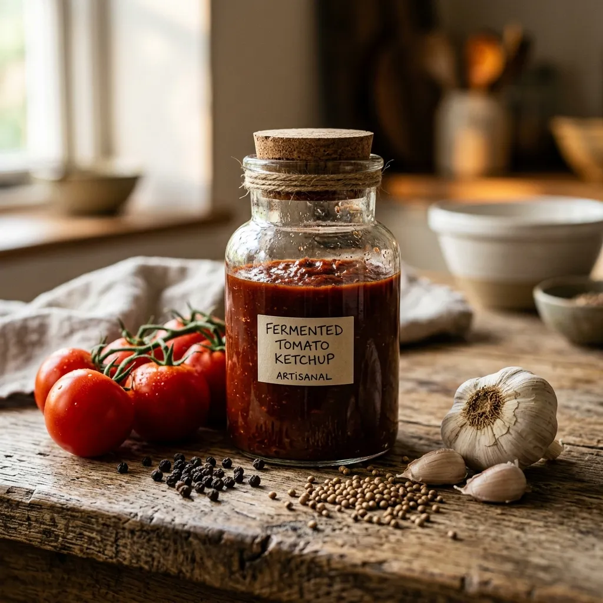

# Tim Spector's Fermented Tomato Ketchup

{ loading=lazy }

| :fork_and_knife_with_plate: Serves | :timer_clock: Total Time |
|:----------------------------------:|:-----------------------: |
| 1 jar | 3.00 days |

## :salt: Ingredients

- :tomato: 200 g tomato purée
- :takeout_box: 1 Tbsp (14 g) Worcestershire sauce or soy sauce
- :takeout_box: 1 fish sauce
- :apple: 1 Tbsp runny honey
- :apple: 1 Tbsp (18 g) apple cider vinegar
- :hot_pepper: 2.5 tsp sauerkraut brine
- :apple: 2 tsp (6 g) coriander seeds
- :hot_pepper: 0.5 tsp (2 g) black peppercorns
- :seedling: 1 tsp mustard seeds
- :chestnut: 0.12 tsp ground cinnamon
- :salt: some salt

## :cooking: Cookware

- 1 bowl
- 1 frying pan
- 1 spice grinder or mortar and pestle
- 1 jam jar
- 1 refrigerator

## :pencil: Instructions

### Step 1

In a bowl, combine tomato purée, Worcestershire sauce or soy sauce, a splash of fish sauce, runny honey (or fermented
garlic honey), apple cider vinegar, and sauerkraut brine (optional).

### Step 2

In a dry frying pan over low-medium heat, gently toast coriander seeds, black peppercorns, and mustard seeds for about 1
minute until aromatic.

### Step 3

Finely grind the toasted spices in a spice grinder or mortar and pestle with ground cinnamon and salt. Add this spice
mixture to the tomato base and stir to combine.

### Step 4

Spoon the mixture into a clean jam jar, secure the lid, and keep it at room temperature, out of direct sunlight. Stir
the mixture every day for 3 days until it begins to ferment. Move the ketchup to the refrigerator where it can be stored
for up to 4 weeks.

## :link: Source

- Tim Spector
