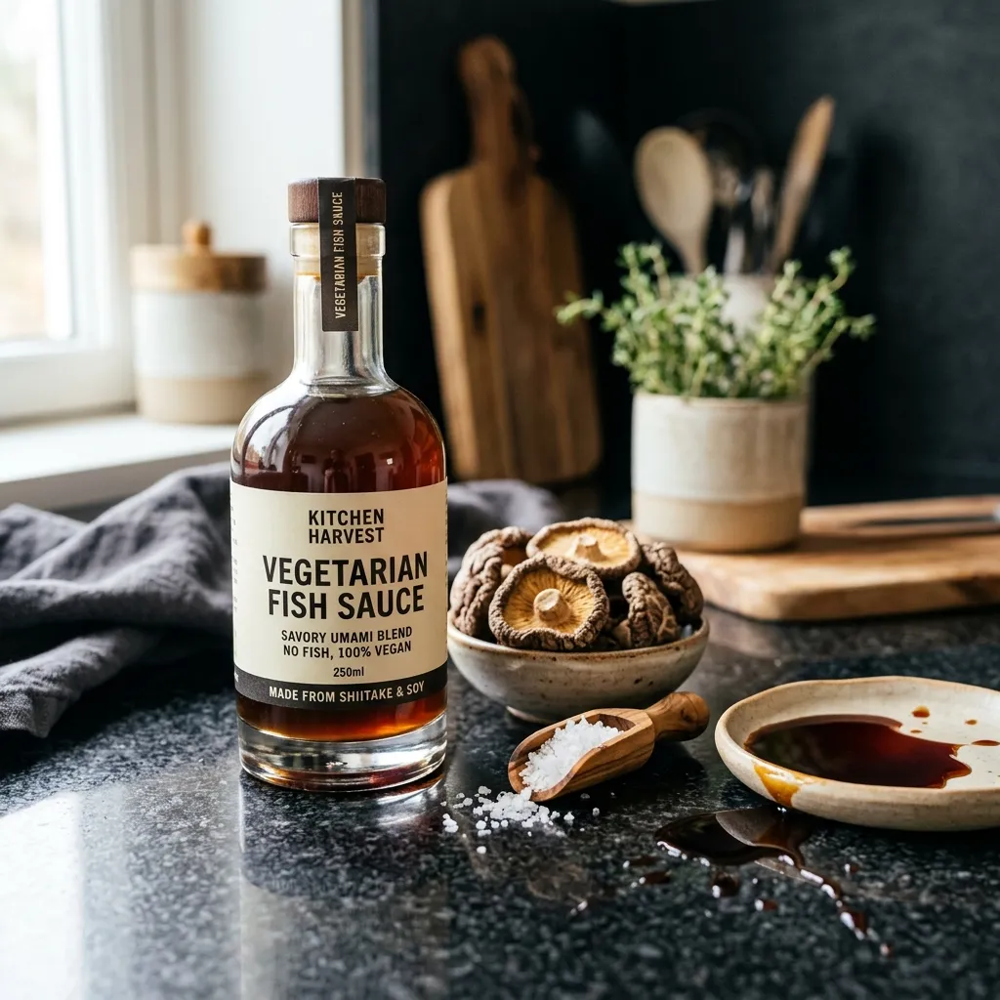

# Vegetarian Fish Sauce

{ loading=lazy }

| :fork_and_knife_with_plate: Serves | :timer_clock: Total Time |
|:----------------------------------:|:-----------------------: |
| 12 | 20 minutes |

## :salt: Ingredients

=== "Simmered Shiitake Version"

    - :droplet: 3 cups (681 g) water
    - :mushroom: 0.25 oz (5 g) dried sliced shiitake mushrooms
    - :salt: 3 Tbsp salt
    - :takeout_box: 2 Tbsp (18 g) soy sauce

=== "Quick Mushroom Powder Version"

    - :apple: 1 tsp (2 g) mushroom powder (e.g., Po Ku)
    - :droplet: 1.5 cups (340 g) water
    - :salt: 3 Tbsp salt
    - :takeout_box: 2 Tbsp (18 g) soy sauce

## :cooking: Cookware

- 1 medium saucepan
- 1 fine-mesh sieve
- 1 airtight container
- 1 refrigerator
- 1 airtight container
- 1 refrigerator

## :pencil: Instructions

### Step 1

**Simmered Shiitake Version**: In a medium saucepan, simmer water, dried sliced shiitake mushrooms, salt, and soy sauce
over medium heat until reduced by half (to about 1.5 cups), about 20 minutes. Strain the mixture through a fine-mesh
sieve into an airtight container. Allow to cool to room temperature, then seal and store in the refrigerator for up to 3
weeks.

### Step 2

**Quick Mushroom Powder Version**: Alternatively, whisk mushroom powder (e.g., Po Ku) in warm water with salt and soy
sauce in an airtight container until fully dissolved. Allow to cool, then seal and store in the refrigerator for up to 3
weeks.

## :link: Source

- <https://www.americastestkitchen.com/how_tos/6610-making-a-vegetarian-substitute-for-fish-sauce>
