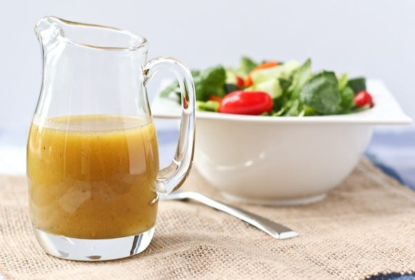

# :honey_pot: Honey Mustard Vinaigrette

| :fork_and_knife_with_plate: Serves | :timer_clock: Total Time |
|:----------------------------------:|:-----------------------: |
| 1/2 cup | 5 minutes |

## :salt: Ingredients

- :lemon: 2 Tbsp lemon juice
- :champagne: 1 Tbsp white wine vinegar
- :honey_pot: 1 Tbsp honey
- :hotdog: 1 tsp coarse-grain mustard
- :salt: some salt
- :salt: some pepper
- :olive: 6 Tbsp olive oil

## :cooking: Cookware

- 1 bowl

## :pencil: Instructions

### Step 1

Whisk together in a bowl lemon juice, white wine vinegar, honey, coarse-grain mustard, and salt and pepper to taste.

### Step 2

Add in a slow, steady stream, whisking constantly olive oil.

### Step 3

Taste and adjust the seasonings.

## :link: Source

- Joy of Cooking
