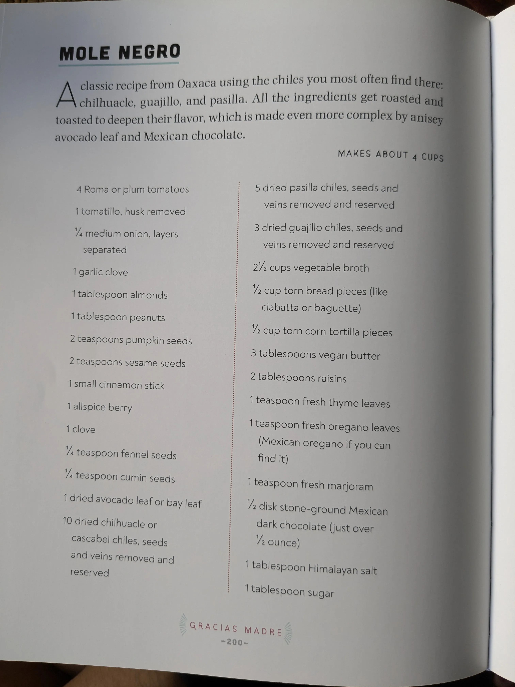

# :tomato: Mole Negro

{ loading=lazy }

| :fork_and_knife_with_plate: Serves | :timer_clock: Total Time |
|:----------------------------------:|:-----------------------: |
| 4 cups | 1 hour |

## :salt: Ingredients

- :tomato: 4 Roma or plum tomatoes
- :tomato: 1 tomatillo, husk removed
- :tea: 0.25 onion, layers separated
- :garlic: 1 garlic clove
- :chestnut: 1 Tbsp (5 g) almonds
- :chestnut: 1 Tbsp (9 g) peanuts
- :seedling: 2 tsp (7 g) pumpkin seeds
- :seedling: 2 tsp (6 g) sesame seeds
- :chestnut: 1 small cinnamon stick
- 1 allspice berry
- :garlic: 1 clove
- :seedling: 0.125 tsp (0.4 g) fennel seeds
- :chestnut: 0.125 tsp (0.4 g) cumin seeds
- :herb: 1 dried avocado leaf or bay leaf
- :hot_pepper: 10 dried chilhuacle or Cascabel chiles, seeds and veins removed and reserved
- :hot_pepper: 5 dried pasilla chiles, seeds and veins removed and reserved
- :hot_pepper: 3 dried guajillo chiles, seeds and veins removed and reserved
- 2.5 cups [Vegetable Broth](../../ingredients/vegetable-broth.md)
- :bread: 0.5 cup (142 g) torn bread pieces (like ciabatta or baguette)
- :bread: 0.5 cup (76 g) torn corn tortilla pieces
- :butter: 3 Tbsp (51 g) vegan butter
- :grapes: 2 Tbsp (19 g) raisins
- :herb: 1 tsp (4 g) fresh thyme leaves
- :herb: 1 tsp (3 g) fresh oregano leaves
- :herb: 0.5 tsp fresh marjoram
- :chestnut: 0.5 disk stone-ground Mexican dark chocolate, broken into pieces
- :salt: 1 Tbsp Himalayan salt
- :candy: 1 Tbsp (10 g) sugar

## :cooking: Cookware

- #pan
- #blender
- #pot

## :pencil: Instructions

### Step 1

Roast the :tomato: Roma or plum tomatoes, :tomato: tomatillo, husk removed, :onion: onion, layers separated, and :garlic: garlic clove in a #pan until charred. Transfer the vegetables to a high-speed #blender.

### Step 2

Wipe out any debris from the pan. Add the :chestnut: almonds, :chestnut: peanuts, :seedling: pumpkin seeds, :seedling: sesame seeds, :chestnut: small cinnamon stick, :chestnut: allspice berry, :chestnut: clove, :seedling: fennel seeds, and :chestnut: cumin seeds and arrange in a single layer. Add the :herb: dried avocado leaf or bay leaf on top. Place over very low heat and toast gently, shaking the pan occasionally until fragrant, about ~{5 minutes}. Transfer to the #blender.

### Step 3

Wipe out the pan. Add the cleaned :hot_pepper: dried chilhuacle or Cascabel chiles, seeds and veins removed and reserved, :hot_pepper: dried pasilla chiles, seeds and veins removed and reserved, and :hot_pepper: dried guajillo chiles, seeds and veins removed and reserved. Toast over low heat for about 30 to ~{60 seconds} per side. Transfer to the #blender.

### Step 4

Wipe out the pan. Add the reserved veins and seeds from the chiles. Toast over medium-high heat until blackened and beginning to smoke, 3 to ~{5 minutes}. Transfer to the #blender.

### Step 5

To the #blender, add the :stew: [Vegetable Broth](../../ingredients/vegetable-broth.md), :bread: torn bread pieces (like ciabatta or baguette), :bread: torn corn tortilla pieces, :butter: vegan butter, :grapes: raisins, :herb: fresh thyme leaves, :herb: fresh oregano leaves, and :herb: fresh marjoram. Blend until very smooth and creamy.

### Step 6

Transfer to a large #pot, place over medium-high heat, and bring to a boil. Add the :chestnut: stone-ground Mexican dark chocolate, broken into pieces, :salt: Himalayan salt, and :candy: sugar. Reduce heat to medium and stir occasionally until chocolate melts. Simmer for about ~{15 minutes}.

## :link: Source

- <https://github.com/nicholaswilde/recipes/issues/1227>
