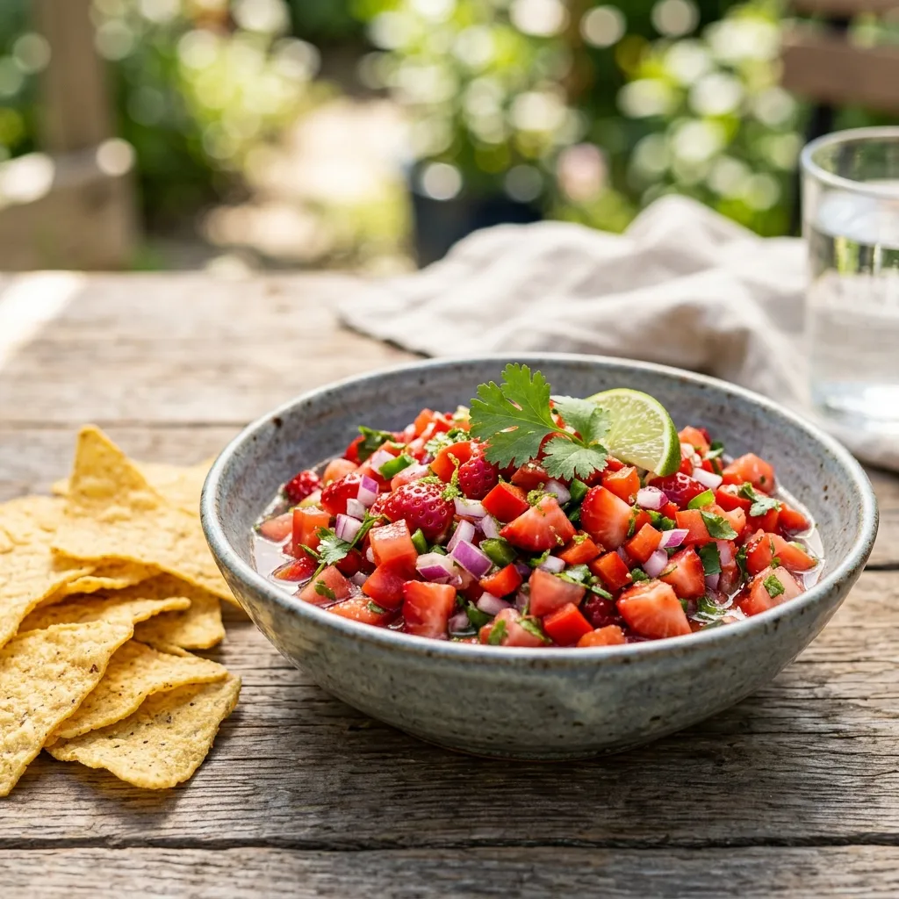

---
tags:
  - applied-kitchen
  - salsa
  - strawberry
  - dip
  - easy
---

# :strawberry: Strawberry Salsa

{ loading=lazy }

| :timer_clock: Total Time |
|:-----------------------: |
| 20 minutes |

## :salt: Ingredients

- :hot_pepper: 1 red jalapeno or Fresno chile
- :tomato: 4 large Roma tomatoes
- :tea: 1 large red onion
- :strawberry: 1 lb strawberries
- :garlic: 4 cloves garlic
- :tangerine: 2 limes
- :tangerine: 1 lemon
- :apple: 4 oz (168 g) agave syrup
- :hot_pepper: 2 large red bell peppers
- :salt: 1 tbsp salt
- :salt: 1 tsp pepper
- :herb: 1 bunch cilantro

## :cooking: Cookware

- 1 small spoon
- 1 bowl

## :pencil: Instructions

### Step 1

Wearing gloves to protect your hands from oil, slice the red jalapeno or Fresno chile in half lengthwise. Use a small
spoon to scrape out the white membrane and seeds and discard. Mince the chili.

### Step 2

Combine the minced chili, Roma tomatoes (diced), red onion (diced), strawberries (diced), garlic (minced), limes
(juiced), lemon (juiced), agave syrup, red bell peppers (diced), salt, and pepper in a bowl, reserving the cilantro.

### Step 3

Mix well and refrigerate for 15 to 20 minutes.

### Step 4

Just before serving, fold in the cilantro (chopped).

### Step 5

Enjoy with your favorite tortilla or [pita](../../breads/pita.md) chips!

## :link: Source

- Applied Kitchen
