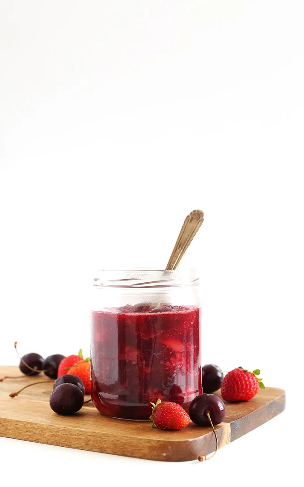

# :strawberry: Simple Berry Compote

{ loading=lazy }

| :fork_and_knife_with_plate: Serves | :timer_clock: Total Time |
|:----------------------------------:|:-----------------------: |
| 5 | 20 minutes |

## :salt: Ingredients

- 3 cups (384 g) fruit
- :tangerine: 3 Tbsp (42 g) orange juice
- :chestnut: 0.25 tsp (1 g) cinnamon (optional)
- :leafy_green: 0.25 tsp (1 g) ginger (optional)
- :candy: 1 tsp (4 g) granulated sugar (optional)
- :apple: 1 tsp (3 g) chia seeds (optional)

## :cooking: Cookware

- 1 small saucepan
- 1 wooden spoon
- 1 jar or container

## :pencil: Instructions

### Step 1

Place fruit and orange juice in a small saucepan and bring to medium heat.

### Step 2

Once bubbling, reduce heat slightly and use a wooden spoon to muddle and mash the fruit.

### Step 3

Continue cooking over medium-low heat for 10 to 12 minutes, occasionally mashing fruit to combine. Turn off heat and add
optional add-ins at this point (cinnamon (optional), ginger (optional), granulated sugar (optional), chia seeds
(optional)).

### Step 4

Remove from heat and transfer to a clean jar or container to cool thoroughly. Store in the fridge up to 1 week or freeze
in ice cube molds up to 1 month. Reheat to serve with oats, pancakes, waffles, french toast, and more!

## :link: Source

- <https://minimalistbaker.com/simple-berry-compote/>
