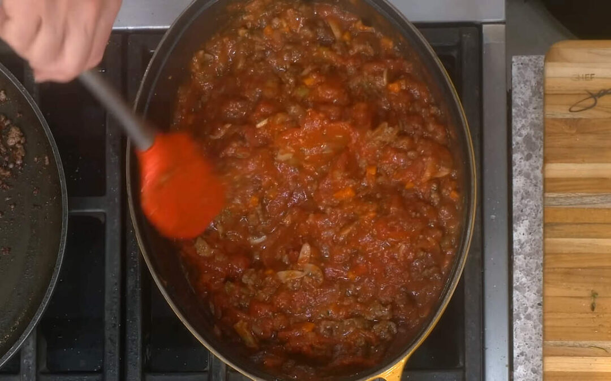

# :tomato: Tomato Ragu

| :timer_clock: Total Time |
|:-----------------------: |
| 56 minutes |

## :salt: Ingredients

- :olive: 2 Tbsp olive oil
- :onion: 1.5 cup (213 g) onion
- :leafy_green: 0.5 cup (71 g) celery
- :carrot: 0.5 cup (71 g) carrots
- :hotdog: 1.5 lbs (680 g) vegetarian sausage
- :mushroom: 0.5 lb (227 g) mushrooms
- :herb: 1 Tbsp fresh thyme
- :garlic: 2 Tbsp garlic
- :tomato: 2 28-oz cans tomatoes
- :tomato: 1.5 cups (348 g) tomato puree
- :salt: some salt
- :salt: some pepper
- :herb: 0.25 cup parsley

## :cooking: Cookware

- 1 Dutch oven
- 1 frying pan

## :pencil: Instructions

### Step 1

In a Dutch oven, heat a little extra virgin olive oil and sauté the onion until lightly caramelized, about 4 minutes.
Add the celery and carrots and cook for 1 to 2 minutes.

### Step 2

In a frying pan, add a couple spoons of olive oil and when hot add the vegetarian sausage and brown until caramelized.
Constantly breaking the sausage up while it cooks so you have small uniform crumbles. When deep golden brown, remove the
meat from the pan and drain any extra fat.

### Step 3

Back in the Dutch oven, add the mushrooms and sweat them for 5 minutes or however long it takes to eliminate the water.
Add the fresh thyme and garlic when fragrant, chopped tomatoes and tomato puree. Add the cooked vegetarian meat, adjust
with salt and pepper and let simmer slowly for 45 minutes.

### Step 4

Add the parsley at the end.

## :link: Source

- <https://chefjeanpierre.com/recipes/tomato-meat-sauce/>
