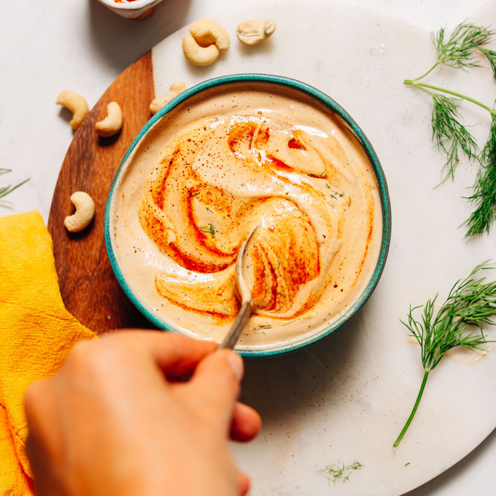

# :hot_pepper: Vegan Chipotle Ranch Dressing

| :timer_clock: Total Time |
|:-----------------------: |
| 4.53 hours |

## :salt: Ingredients

- :chestnut: 1 cup cashews
- :glass_of_milk: 0.67 cup unsweetened almond milk
- :lemon: 2 tsp lemon juice
- :garlic: 1 clove garlic
- :salt: 0.5 tsp salt
- :hot_pepper: 1 chipotle pepper in adobo sauce
- :onion: 0.25 tsp onion powder
- :sake: 1 tsp apple cider vinegar
- :maple_leaf: 1 tsp maple syrup (optional)
- :hot_pepper: 0.25 tsp ground chipotle chile
- :herb: 2 Tbsp dill

## :cooking: Cookware

- 1 small blender

## :pencil: Instructions

### Step 1

Soak cashews in very hot water for 30 minutes. While cashews are soaking, measure out unsweetened almond milk and add
lemon juice and set aside to curdle (this makes your vegan “buttermilk”).

### Step 2

Drain and rinse cashews, then transfer to a small blender (a blender is preferred over a food processor for achieving a
smooth texture) and add almond "buttermilk", garlic, salt, chipotle pepper in adobo sauce, onion powder, apple cider
vinegar, maple syrup (optional), ground chipotle chile, and dill. Blend on high for 1 to 2 minutes or until very creamy
and smooth, stopping to scrape down sides as needed.

### Step 3

Taste and adjust flavor as needed, adding more salt to taste, ground chipotle or adobo sauce for heat, maple syrup for
sweetness, lemon juice or vinegar for acidity, garlic for garlic flavor, or herbs for a more herbal flavor.

### Step 4

Use immediately at room temperature or refrigerate for 3 to 4 hours to chill. It will thicken in the refrigerator, so
you can add more almond milk or water later on to thin if needed.

## :link: Source

- <https://minimalistbaker.com/vegan-chipotle-ranch-dressing/>
