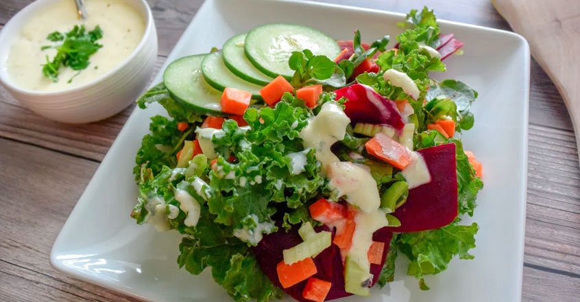

# :herb: Vegan Ranch Dressing

| :timer_clock: Total Time |
|:-----------------------: |
| 0 minutes |

## :salt: Ingredients

- :butter: 2 lb tofu
- :herb: 1.5 Tbsp parsley
- :onion: 0.75 onion
- :garlic: 2 cloves garlic
- :sake: 3 Tbsp white vinegar
- :cactus: 2 Tbsp agave syrup
- :lemon: 1 Tbsp lemon juice
- :microbe: 1 tsp nutritional yeast
- :hotdog: 1 tsp dry mustard
- :hot_pepper: 0.25 tsp paprika
- :leafy_green: 0.5 tsp celery seeds
- :herb: 1 tsp dill
- :herb: 1 Tbsp chives
- :droplet: 0.75 cup water

## :cooking: Cookware

- 1 food processor

## :pencil: Instructions

### Step 1

Blend tofu, parsley, chopped, onion, finely chopped, garlic, white vinegar, agave syrup, lemon juice, nutritional yeast,
dry mustard, paprika, celery seeds, dill, chives, and water in a food processor until smooth.

### Step 2

Serve over your favorite salad, or use as a dip for vegetables.

## :link: Source

- <https://nutritionstudies.org/recipes/salad-dressing/ranch-dressing/>
