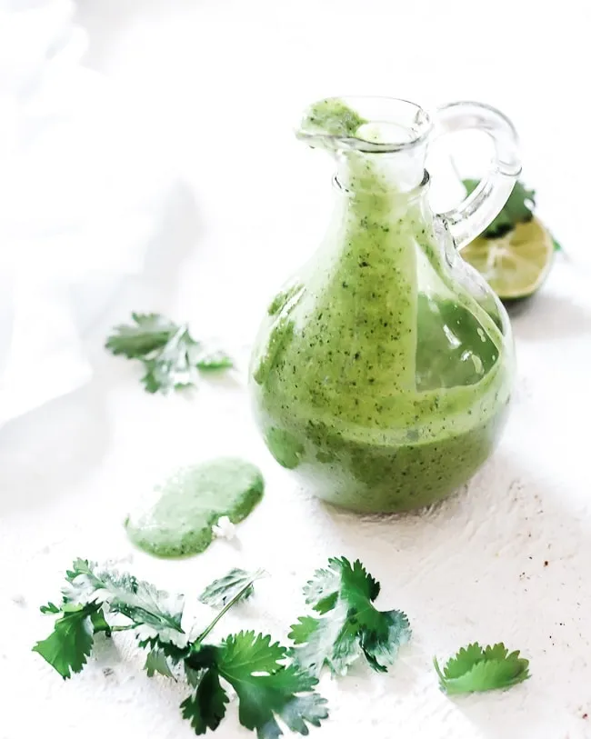

# :herb: Cilantro Dressing

{ loading=lazy }

| :fork_and_knife_with_plate: Serves | :timer_clock: Total Time |
|:----------------------------------:|:-----------------------: |
| 4 | 5 minutes |

## :salt: Ingredients

- :wine_glass: 0.33 cup (9 g) rice vinegar
- :olive: 4 Tbsp (50 g) olive oil
- 0.25 cup [mayonnaise][2]
- :cheese_wedge: 3 oz (43 g) cotija cheese or [queso fresco][3]
- :tangerine: 1 lime juice
- :garlic: 1 clove garlic
- :hot_pepper: 1 jalapeño
- :herb: 0.5 cup (21 g) cilantro
- :salt: 0.5 Tbsp salt

## :cooking: Cookware

- 1 blender

## :pencil: Instructions

!!! note

    This is copycat of [TJ's Cilantro Dressing][1]

### Step 1

Add rice vinegar, olive oil, [mayonnaise][2], cotija cheese or [queso fresco][3], lime juice, garlic, jalapeño,
cilantro, and salt to a blender in the order given.

### Step 2

Process until smooth.

## :link: Source

- <https://ohsodelicioso.com/poblano-cilantro-salad-dressing-with-spicy-chicken-salad/>

[1]: <https://www.traderjoesgroceryreviews.com/trader-joes-cilantro-dressing/>
[2]: <../../sauces-and-dressings/dips-and-spreads/mayonnaise.md>
[3]: <../../ingredients/queso-fresco.md>
