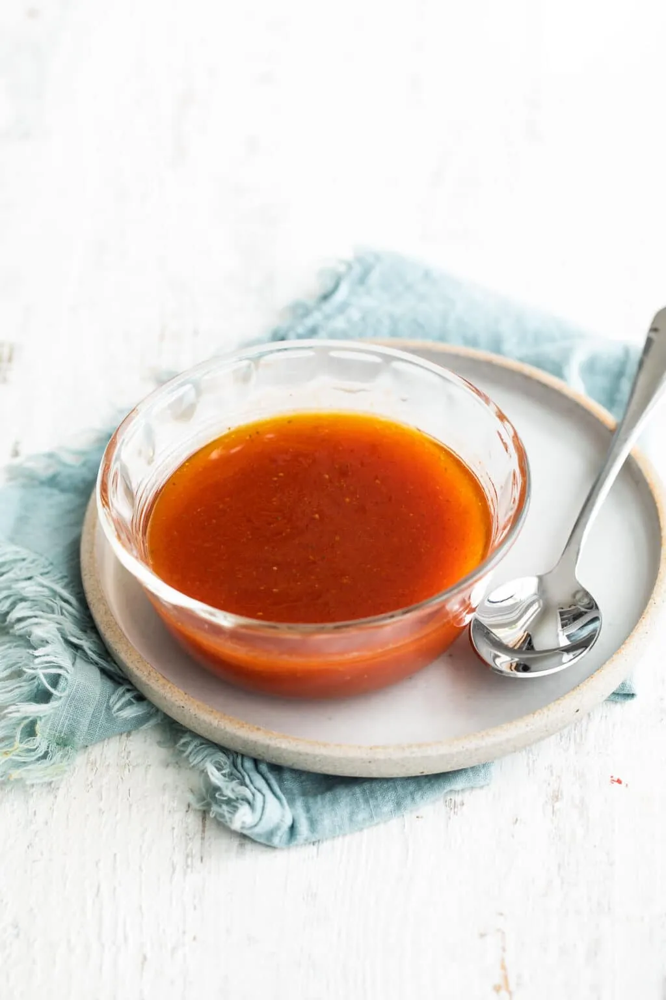

# :green_salad: French Dressing

{ loading=lazy }

| :fork_and_knife_with_plate: Serves | :timer_clock: Total Time |
|:----------------------------------:|:-----------------------: |
| 16 | 5 minutes |

## :salt: Ingredients

- :candy: 1 cup (156 g) sugar
- 0.67 cup [ketchup][1]
- :olive: 0.5 cup (100 g) olive oil
- :takeout_box: 0.5 cup (53 g) white vinegar
- :leafy_green: 0.5 tsp (1 g) celery seed
- :hot_pepper: 0.5 tsp (1 g) chili powder
- :herb: 0.5 tsp (1 g) dried mustard
- :chestnut: 0.5 tsp (1 g) onion powder
- :candy: 0.13 tsp paprika
- :salt: 2 tsp salt

## :cooking: Cookware

- 1 food processor or blender

## :pencil: Instructions

### Step 1

In a food processor or blender, add sugar, [ketchup][1], olive oil, white vinegar, celery seed, chili powder, dried
mustard, onion powder, paprika, and salt to taste (I like 2 teaspoons). Process until smooth and store covered in the
refrigerator for up to 4 days.

## :link: Source

- <https://www.culinaryhill.com/homemade-french-dressing-recipe/>

[1]: <../../sauces-and-dressings/sweet-sauces/sweet-and-spicy-ketchup.md>
