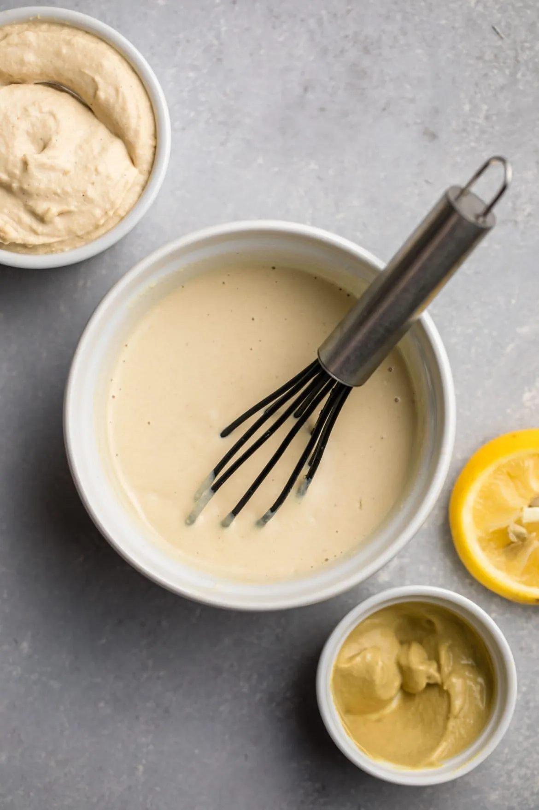

# :falafel: Hummus-Orange Juice Dressing

{ loading=lazy }

| :fork_and_knife_with_plate: Serves | :timer_clock: Total Time |
|:----------------------------------:|:-----------------------: |
| 1/2 cup | 5 minutes |

## :salt: Ingredients

- 3 Tbsp [hummus][1]
- :tangerine: 3 Tbsp (42 g) orange juice
- 1 tsp [mustard][2] of choice
- :wine_glass: 2 Tbsp balsamic vinegar
- :sweet_potato: 0.5 tsp (2 g) pealed and chopped fresh ginger

## :cooking: Cookware

- 1 small bowl
- 1 whisk

## :pencil: Instructions

### Step 1

Mix [hummus][1], orange juice, [mustard][2] of choice, balsamic vinegar, and pealed and chopped fresh ginger in a small
bowl and whisk until smooth.

## :link: Source

- Prevent and Reverse Heart Disease by Caldwell B. Esselstyn, Jr., M.D.

[1]: <../../sauces-and-dressings/dips-and-spreads/hummus.md>
[2]: <../dijon-mustard.md>
