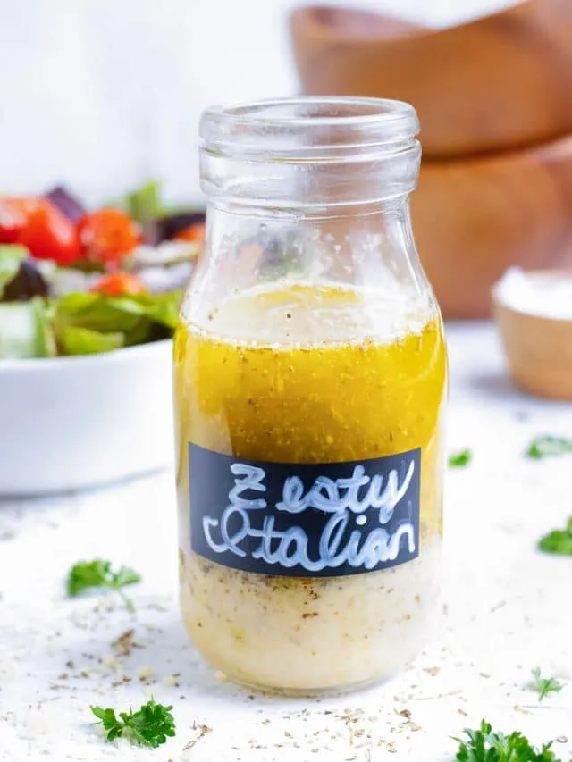

# Italian Dressing

{ loading=lazy }

| :fork_and_knife_with_plate: Serves | :timer_clock: Total Time |
|:----------------------------------:|:-----------------------: |
| 5 | 10 minutes |

## :salt: Ingredients

- :olive: 0.5 cup (100 g) olive oil
- :wine_glass: 2 Tbsp (18 g) white wine vinegar
- :garlic: 1 each garlic clove
- :herb: 2 tsp (5 g) Italian seasoning
- :tangerine: 2 tsp (9 g) lemon juice
- :cheese_wedge: 3 Tbsp (19 g) grated Parmesan cheese
- :honey_pot: 2 tsp honey
- :salt: some salt

## :cooking: Cookware

- 1 mason jar
- 1 blender
- 1 food processor
- 1 refrigerator

## :pencil: Instructions

### Step 1

Add olive oil, white wine vinegar, garlic clove (finely minced), Italian seasoning, lemon juice (from 1 lemon), grated
Parmesan cheese, honey (optional), and salt to a 16-ounce mason jar and shake until well combined. Alternatively, you
can add the ingredients to a high-speed blender or food processor and blend for 10 to 20 seconds, or until smooth.

### Step 2

Use immediately or store Italian dressing in the refrigerator for up to 1 week between servings. Bring to room
temperature for 5 to 10 minutes and shake well before using.

## :link: Source

- <https://www.evolvingtable.com/italian-dressing-recipe/>
