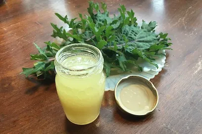

# :green_salad: Jane's 3, 2, 1 Salad Dressing

{ loading=lazy }

| :fork_and_knife_with_plate: Serves | :timer_clock: Total Time |
|:----------------------------------:|:-----------------------: |
| 1/3 cup | 5 minutes |

## :salt: Ingredients

- :wine_glass: 3 Tbsp balsamic vinegar
- 2 Tbsp [mustard][1] of choice
- :honey_pot: 1 Tbsp (20 g) maple syrup

## :cooking: Cookware

- 1 small bowl
- 1 whisk

## :pencil: Instructions

### Step 1

Mix balsamic vinegar, [mustard][1] of choice, and maple syrup in a small bowl and whisk until smooth.

## :link: Source

- Prevent and Reverse Heart Disease by Caldwell B. Esselstyn, Jr., M.D.

[1]: <../dijon-mustard.md>
