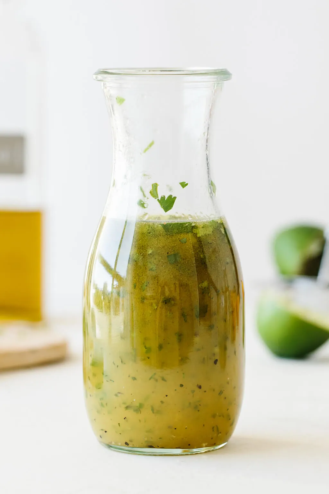

# :tangerine: Orange Juice-Lime Salad Dressing

{ loading=lazy }

| :fork_and_knife_with_plate: Serves | :timer_clock: Total Time |
|:----------------------------------:|:-----------------------: |
| 1/2 cup | 0 minutes |

## :salt: Ingredients

- :tangerine: 0.33 cup (74 g) orange juice
- :sweet_potato: 1 tsp (5 g) peeled and chopped fresh ginger
- :tangerine: 1 lime juice and zest
- :wine_glass: 2 Tbsp raspberry balsamic vinegar

## :cooking: Cookware

- 1 small bowl
- 1 whisk

## :pencil: Instructions

### Step 1

Mix orange juice, peeled and chopped fresh ginger, lime juice and zest and raspberry balsamic vinegar in a small bowl
and whisk until smooth.

!!! note

    If you cannot find raspberry balsamic vinegar, use regular balsamic or any vinegar of your choice.

## :link: Source

- Prevent and Reverse Heart Disease by Caldwell B. Esselstyn, Jr., M.D.
