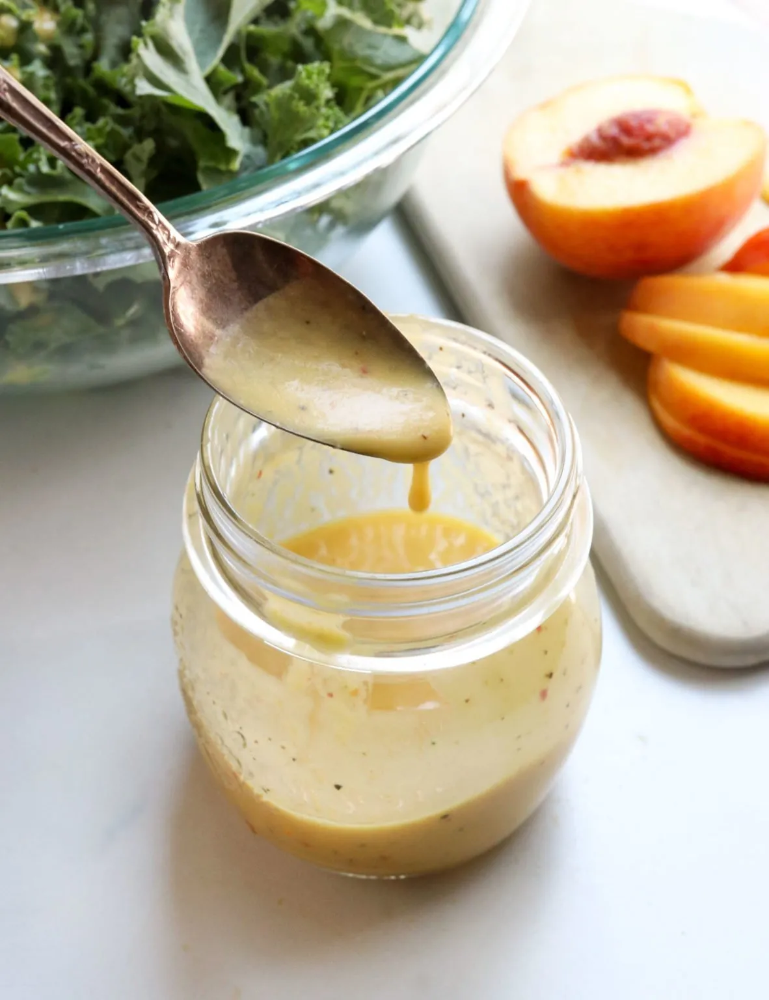

# :green_salad: Rip's Salad Dressing

{ loading=lazy }

| :fork_and_knife_with_plate: Serves | :timer_clock: Total Time |
|:----------------------------------:|:-----------------------: |
| 1/2 cup | 5 minutes |

## :salt: Ingredients

- :tangerine: 1 lemon, lime, or orange juice
- :apple: 1 tsp (5 g) tamari or soy sauce (optional)
- :cheese_wedge: 1 tsp (1 g) nutritional yeast
- :seedling: 1 tsp mustard of choice
- :wine_glass: 2 Tbsp balsamic vinegar or any vinegar of choice
- :hot_pepper: 1 tsp (7 g) molasses or honey (optional)

## :cooking: Cookware

- 1 small bowl
- 1 whisk

## :pencil: Instructions

### Step 1

Mix lemon, lime, or orange juice, tamari or soy sauce (optional), nutritional yeast, mustard of choice, balsamic
vinegar or any vinegar of choice, and molasses or honey (optional) in a small bowl and whisk until smooth.

## :link: Source

- Prevent and Reverse Heart Disease by Caldwell B. Esselstyn, Jr., M.D.
