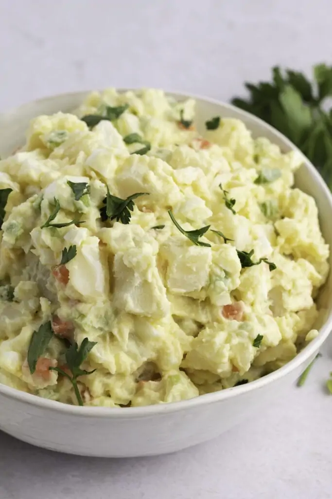

# :potato: Amish Potato Salad

{ loading=lazy }

| :fork_and_knife_with_plate: Serves | :timer_clock: Total Time |
|:----------------------------------:|:-----------------------: |
| 8 | 1.50 hours |

## :salt: Ingredients

- :potato: 5 medium white potatoes
- :egg: 2 eggs
- :candy: 0.75 cup granulated sugar
- :corn: 1 tsp cornstarch
- :salt: 0.5 tsp salt
- :sake: 0.33 cup apple cider vinegar
- :glass_of_milk: 0.5 cup milk
- :hotdog: 1 tsp yellow mustard
- :butter: 3 Tbsp unsalted butter
- :egg: 1 cup [mayonnaise][1]
- :onion: 1 small onion, finely chopped
- :leafy_green: 1 cup chopped celery
- :carrot: 1 cup carrots
- :leafy_green: 1 tsp celery seed
- :egg: 4 hard-boiled eggs

## :cooking: Cookware

- 1 large pot
- 1 saucepan
- 1 large bowl

## :pencil: Instructions

### Step 1

Place the white potatoes in a large pot and fill it with enough salted water to cover them. Bring the water to a boil
and continue to cook for 20 minutes, or until the potatoes are fork-tender. Drain and set aside to cool.

### Step 2

Meanwhile, make the dressing. Whisk together the 2 eggs, granulated sugar, cornstarch, and salt in a saucepan over
medium heat. Mix in the apple cider vinegar, milk, and yellow mustard. Continue to cook, stirring continuously for about
10 minutes, or until thick.

### Step 3

Remove from heat and mix in the unsalted butter. Allow the dressing to cool in the fridge. Mix in the [mayonnaise][1].

### Step 4

Peel the potatoes, if desired. Slice them into bite-sized cubes and place them in a large bowl. Mix in the onion, finely
chopped, chopped celery, carrots, celery seed, and 4 hard-boiled eggs. Gently toss in the dressing. Refrigerate for at
least 1 hour, better if overnight. Serve chilled and enjoy!

## :link: Source

- <https://insanelygoodrecipes.com/amish-potato-salad/>

[1]: <../sauces-and-dressings/mayonnaise.md>
