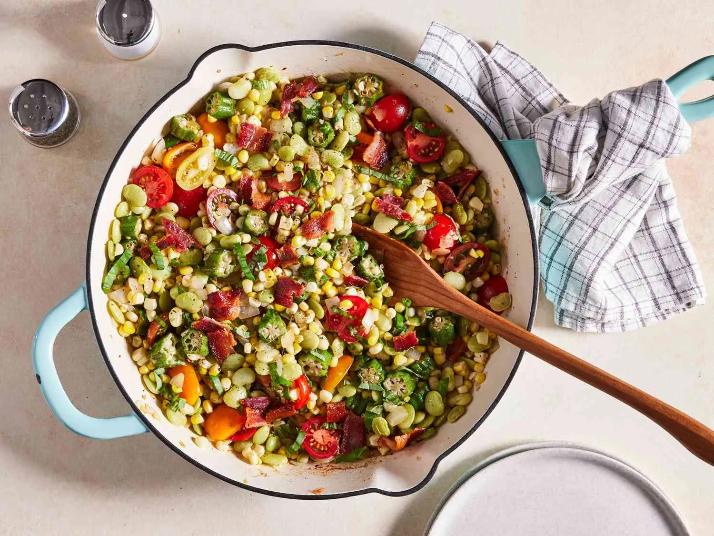

# :corn: Best-Ever Succotash

{ loading=lazy }

| :fork_and_knife_with_plate: Serves | :timer_clock: Total Time |
|:----------------------------------:|:-----------------------: |
| 6 | 24 minutes |

## :salt: Ingredients

- :beans: 10 ounces (175 g) fresh or frozen baby lima beans
- :bacon: 4 center-cut bacon slices
- :tea: 1 cup (140 g) chopped sweet onion
- :apple: 4 ounces fresh okra
- :garlic: 1 garlic clove
- :corn: 3 cups (456 g) fresh corn kernels
- :salt: 0.25 tsp kosher salt
- :salt: 0.25 tsp (1 g) black pepper
- :butter: 3 tbsp butter
- :tomato: 5 ounces (210 g) cherry tomatoes
- :herb: 0.25 cup (10 g) fresh basil

## :cooking: Cookware

- 1 saucepan
- 1 skillet
- 1 skillet
- 1 skillet

## :pencil: Instructions

### Step 1

Place fresh or frozen baby lima beans (2 cups) in a medium saucepan, and add water to cover. Bring to a boil over
medium-high. Reduce to medium-low, and simmer until beans are just tender, 8 to 10 minutes. Drain and set aside.

### Step 2

While beans simmer, place center-cut bacon slices in a large cast-iron skillet over medium. Cook until crisp, about 8
minutes, turning once after 5 minutes. Transfer bacon to paper towels; crumble and set aside. Reserve drippings in
skillet.

### Step 3

Add chopped sweet onion (from 1 small onion), fresh okra (cut into ½-inch-thick slices), and garlic clove (finely
chopped) to skillet over medium, and cook, stirring often, until onion is just tender, about 6 minutes.

### Step 4

Stir in fresh corn kernels (4 ears), kosher salt, black pepper, and the drained beans, and cook, stirring often, until
corn is tender and bright yellow, 5 to 6 minutes.

### Step 5

Add butter, and cook, stirring constantly, until butter is melted, about 1 minute. Remove from heat.

### Step 6

Stir in cherry tomatoes (halved, 1 cup) and thinly sliced fresh basil; sprinkle with crumbled bacon, and serve
immediately.

## :link: Source

- <https://www.southernliving.com/recipes/best-ever-succotash-recipe>
