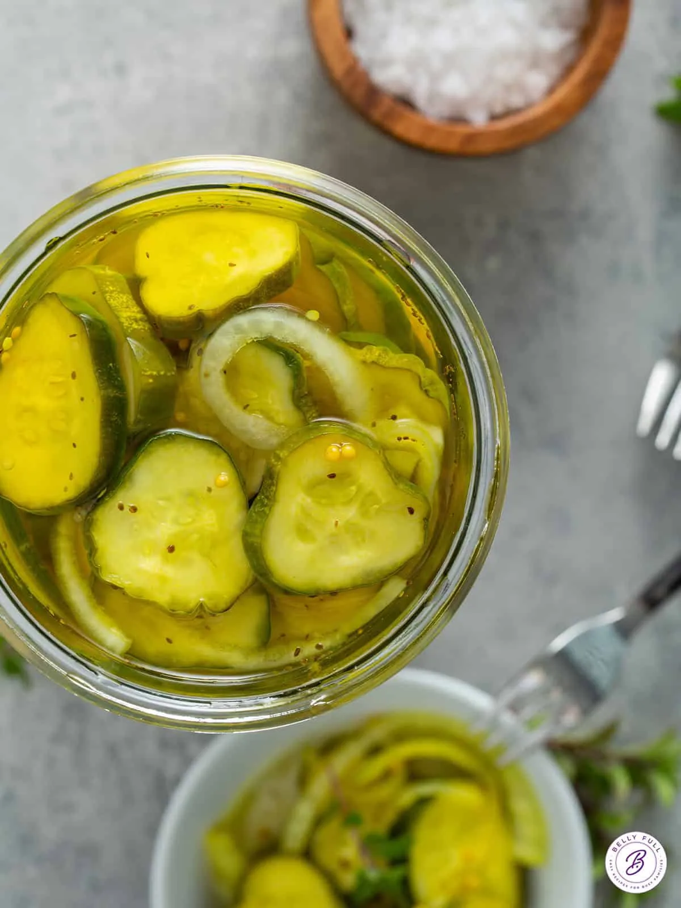

# Bread and Butter Pickles

{ loading=lazy }

| :fork_and_knife_with_plate: Serves | :timer_clock: Total Time |
|:----------------------------------:|:-----------------------: |
| 16 | 0 minutes |

## :salt: Ingredients

- :apple: 1 amp; 1/2 pounds pickling cucumbers ( , sliced 1/4-inch thick (about 5 &amp; 1/2 cups))
- :apple: 1 amp; 1/2 tablespoons coarse salt
- :tea: 1 cup (240 g) thinly sliced sweet onion
- :candy: 1 cup (198 g) granulated sugar
- :takeout_box: 1 cup (106 g) white vinegar
- :apple: 0.5 cup (140 g) apple cider vinegar
- :candy: 0.25 cup (53 g) light brown sugar
- :apple: 1 amp; 1/2 teaspoons mustard seeds
- :chestnut: 0.5 teaspoon (1 g) celery seeds
- :curry: 0.12 teaspoon ground turmeric
- :candy: 1 granulated
- :beans: 1 white
- :apple: 1 apple
- :leafy_green: 1 celery
- :apple: 1 ground

## :cooking: Cookware

- 1 bowl
- 1 colander
- 1 bowl
- 1 bowl
- 1 saucepan

## :pencil: Instructions

### Step 1

amp; 1/2 pounds pickling cucumbers ( , sliced 1/4-inch thick (about 5 &amp; 1/2 cups)) amp; 1/2 tablespoons coarse salt
thinly sliced sweet onion granulated sugar white vinegar apple cider vinegar light brown sugar amp; 1/2 teaspoons
mustard seeds celery seeds ground turmeric

### Step 2

Combine cucumbers and salt in a large, shallow bowl; cover and chill for 1 &amp; 1/2 hours.

### Step 3

Move cucumbers into a colander and rinse thoroughly under cold water. Drain well, and return cucumbers to bowl.

### Step 4

Add onion to the bowl and toss with the cucumbers.

### Step 5

Combine the granulated sugar, white vinegar, apple cider vinegar, brown sugar, mustard seeds, celery seeds and ground
turmeric in a medium saucepan; bring to a simmer over medium heat, stirring until the sugar dissolves.

### Step 6

Pour the hot vinegar mixture over cucumber mixture; let stand at room temperature 1 hour.

### Step 7

Cover and refrigerate 24 hours. (If you’re really impatient, though, they taste great after only a few hours!)

### Step 8

Store in an airtight container in refrigerator up to 1 month.

## :link: Source

- <https://bellyfull.net/bread-and-butter-pickles/#wprm-recipe-container-35237>
