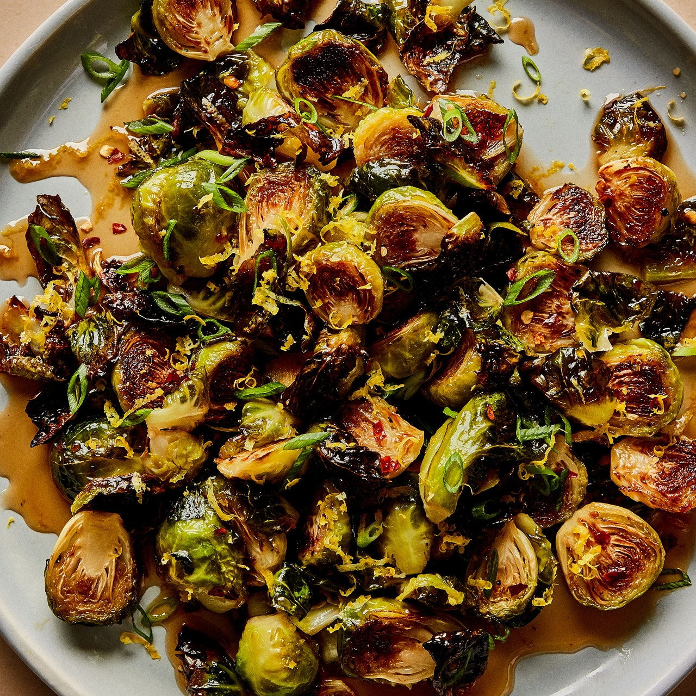

# :leafy_green: Brussels Sprouts With Warm Honey Glaze

{ loading=lazy }

| :timer_clock: Total Time |
|:-----------------------: |
| 33 minutes |

## :salt: Ingredients

- :leafy_green: 1.5 lb Brussels sprouts
- :olive: 0.25 cup olive oil
- :salt: 0.5 tsp salt
- :salt: some pepper
- :honey_pot: 0.25 cup honey
- :sake: 0.33 cup red wine or sherry vinegar
- :hot_pepper: 0.75 tsp red pepper flakes (optional)
- :butter: 3 Tbsp butter
- :salt: 0.5 tsp salt
- :onion: 3 scallions
- :lemon: 1 tsp lemon zest

## :cooking: Cookware

- 1 rimmed baking sheet
- 1 large bowl
- 1 tongs
- 1 small saucepan
- 1 large bowl
- 1 platter

## :pencil: Instructions

### Step 1

Place a rimmed baking sheet on bottom rack of oven; preheat to 450°F. Toss Brussels sprouts and olive oil in a large
bowl; season with salt and black pepper.

### Step 2

Carefully remove baking sheet from oven. Using tongs, arrange Brussels cut side down on baking sheet. Roast Brussels on
bottom rack until softened and deeply browned, 20 to 25 minutes.

### Step 3

Meanwhile, bring honey to a simmer in a small saucepan over medium-high heat. Reduce heat to medium-low and cook,
stirring often, until honey is a deep amber color but not burnt (it will be foamy, that’s okay), 3 to 4 minutes.

### Step 4

Remove from heat and add red wine or sherry vinegar and red pepper flakes (optional), if using, and whisk until sauce is
smooth (it will bubble up quite aggressively when you add the vinegar before settling). Return saucepan to medium heat,
add butter and 1/2 tsp salt, and cook, whisking constantly, until glaze is glossy, bubbling, and slightly thickened, 3
to 4 minutes.

### Step 5

Transfer Brussels sprouts to a large bowl. Add glaze and scallions and toss to combine. Transfer to a platter and top
with lemon zest.

## :link: Source

- <https://www.bonappetit.com/recipe/roasted-brussels-sprouts-with-warm-honey-glaze>
