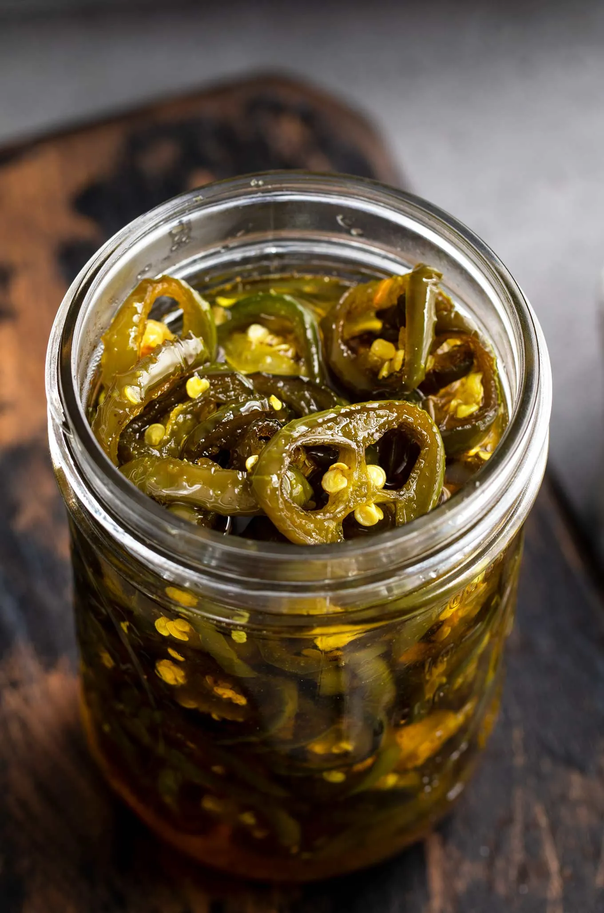

# :hot_pepper: Candied Jalapenos

{ loading=lazy }

| :fork_and_knife_with_plate: Serves | :timer_clock: Total Time |
|:----------------------------------:|:-----------------------: |
| 30 | 45 minutes |

## :salt: Ingredients

- :hot_pepper: 1.5 lbs fresh jalapenos (about 30 peppers)
- :apple: 1 cup (280 g) apple cider vinegar
- :candy: 3 cups (594 g) granulated sugar
- :garlic: 1 tsp garlic powder
- :curry: 0.25 tsp ground turmeric
- :chestnut: 0.25 tsp celery seed

## :cooking: Cookware

- 1 large pot
- 1 slotted spoon
- glass canning jars
- 1 spoon

## :pencil: Instructions

### Step 1

Remove and discard stems from fresh jalapenos (about 30 peppers), then slice into 1/4-inch slices. Set pepper slices
aside.

### Step 2

To a large pot, add apple cider vinegar, granulated sugar, garlic powder, ground turmeric, and celery seed and bring to
a boil. Reduce heat to medium-low and simmer for 5 minutes.

### Step 3

Raise the heat to medium-high to bring mixture back to a boil. Once boiling, add the pepper slices. Allow to return to a
boil, then reduce the heat again to medium-low and simmer for 4 minutes.

### Step 4

Transfer the peppers using a slotted spoon to clean glass canning jars, filling jars to within 1/4 inch of the upper rim
of the jar.

### Step 5

Only the syrup should remain in the pot at this point. Increase the heat to bring to a full rolling boil. Boil like that
for approximately 6 minutes.

### Step 6

Ladle the syrup into the jars with the jalapeno slices. If you notice any air pockets, take a clean spoon and insert it
into the jar to get rid of the trapped air. Fill jars to within 1/4 to 1/2 inch from the upper rim of the jar.

### Step 7

Wipe the rims of the jars with a damp paper towel, then screw on canning jar lids. Label if desired and refrigerate for
at least 1 to 2 weeks (3 to 4 weeks for optimal flavor). Candied jalapenos are good for up to 3 months if kept properly
refrigerated.

## :link: Source

- <https://www.thechunkychef.com/candied-jalapenos/>
