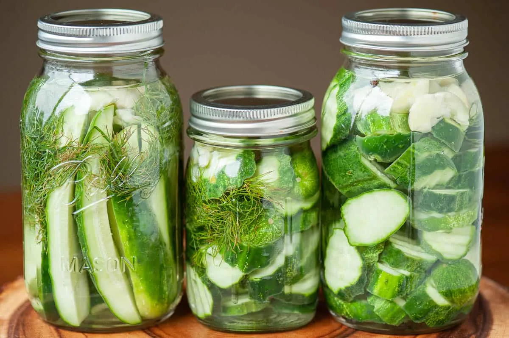

# Easy Refrigerator Dill Pickles

{ loading=lazy }

| :fork_and_knife_with_plate: Serves | :timer_clock: Total Time |
|:----------------------------------:|:-----------------------: |
| 18 | 0 minutes |

## :salt: Ingredients

- :cucumber: 12 pickling cucumbers
- :droplet: 4 cups (908 g) water
- :takeout_box: 2 cups (212 g) white vinegar
- :salt: 2 tablespoons kosher salt
- :candy: 1 teaspoon (3 g) sugar
- :apple: 1 bunch fresh dill
- :garlic: 1 head garlic (skins removed, cloves smashed (use fewer cloves if its a strong garlic))
- :hot_pepper: 1 tablespoon peppercorn kernels
- :takeout_box: 1 pickling
- :droplet: 1 water,
- :beans: 1 white
- :baby_bottle: 1 kosher
- :candy: 1 sugar
- :candy: 1 sugar
- :apple: 1 fresh
- :hot_pepper: 1 peppercorn

## :cooking: Cookware

- 1 saucepan
- 1 pan
- 1 pan
- 1 39;ll

## :pencil: Instructions

### Step 1

pickling cucumbers (quantity can vary depending on size)

### Step 2

water

### Step 3

white vinegar

### Step 4

kosher salt

### Step 5

sugar

### Step 6

fresh dill (amount can vary depending on preference, thick stems removed)

### Step 7

garlic (skins removed, cloves smashed (use fewer cloves if its a strong garlic))

### Step 8

peppercorn kernels (I usually use about 10 peppercorns per jar, give or take)

### Step 9

Prepare ingredients: Thoroughly wash 12 pickling cucumbers. Slice cucumbers into 1/4-inch thick slices or spears. Set
aside. Smash garlic cloves and separate dill from thick stems. Also, sanitize mason jars by running them through the
dishwasher.

### Step 10

Prepare brine: To make the brine, combine 4 cups water, 2 cups white vinegar, 2 tablespoons kosher salt, and 1 teaspoon
sugar in a medium saucepan. Bring the mixture to a boil and swirl the pan to ensure the sugar and salt dissolve. Remove
the pan from heat and cool to room temperature.

### Step 11

Make the pickles: Layer the prepared cucumbers with 1 bunch fresh dill, smashed 1 head garlic, and 1 tablespoon
peppercorn kernels in the jars. Do not pack them super tight as you you&39;ll want room for the brine. Finish by adding
enough brine to cover the cucumbers. Seal with an airtight lid and store in the refrigerator. The flavor is best if
stored for at least one week, but they can be eaten at any time. Pickles should be good for at least 4-6 weeks after
that.

### Step 12

This recipe made enough for me to fill one pint and fill two quart jars.

## :link: Source

- <https://selfproclaimedfoodie.com/easy-refrigerator-dill-pickles/#wprm-recipe-container-32916>
