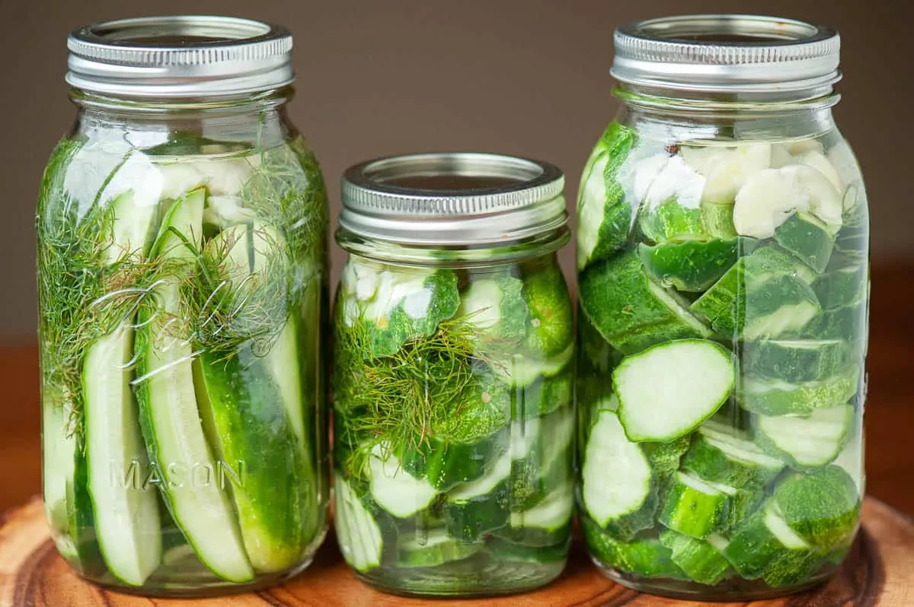

# :cucumber: Easy Refrigerator Dill Pickles

{ loading=lazy }

| :fork_and_knife_with_plate: Serves | :timer_clock: Total Time |
|:----------------------------------:|:-----------------------: |
| 18 | 15 minutes |

## :salt: Ingredients

- :cucumber: 12 pickling cucumbers (quantity can vary depending on size)
- :droplet: 4 cups (908 g) water
- :takeout_box: 2 cups (212 g) white vinegar
- :salt: 2 tablespoons kosher salt
- :candy: 1 teaspoon (3 g) sugar
- :apple: 1 bunch fresh dill (amount can vary depending on preference, thick stems removed)
- :garlic: 1 head garlic (skins removed, cloves smashed (use fewer cloves if it's a strong garlic))
- :hot_pepper: 1 tablespoon peppercorn kernels (usually about 10 peppercorns per jar)

## :cooking: Cookware

- 1 medium saucepan
- pint and quart mason jars (with airtight lids)

## :pencil: Instructions

### Step 1

Prepare ingredients: Thoroughly wash 12 pickling cucumbers. Slice cucumbers into 1/4-inch thick slices or spears. Set
aside. Smash garlic cloves and separate dill from thick stems. Also, sanitize mason jars by running them through the
dishwasher.

### Step 2

Prepare brine: To make the brine, combine 4 cups water, 2 cups white vinegar, 2 tablespoons kosher salt, and 1 teaspoon
sugar in a medium saucepan. Bring the mixture to a boil and swirl the pan to ensure the sugar and salt dissolve. Remove
the pan from heat and cool to room temperature.

### Step 3

Make the pickles: Layer the prepared cucumbers with 1 bunch fresh dill, smashed 1 head garlic, and 1 tablespoon
peppercorn kernels in the jars. Do not pack them super tight as you'll want room for the brine. Finish by adding
enough brine to cover the cucumbers. Seal with an airtight lid and store in the refrigerator. The flavor is best if
stored for at least one week, but they can be eaten at any time. Pickles should be good for at least 4-6 weeks after
that.

!!! note

    This recipe makes enough to fill one pint and two quart jars.

## :link: Source

- <https://selfproclaimedfoodie.com/easy-refrigerator-dill-pickles/#wprm-recipe-container-32916>
