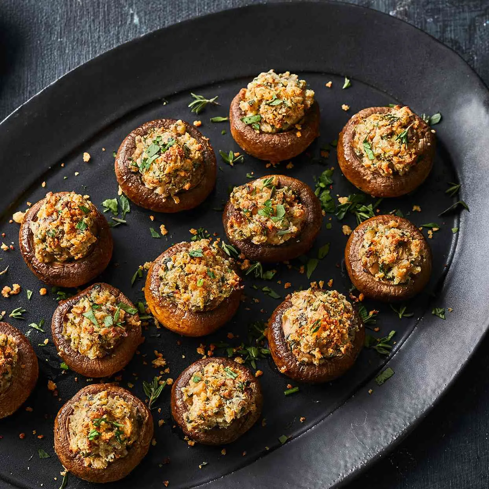

# :mushroom: Easy Stuffed Mushrooms

{ loading=lazy }

| :fork_and_knife_with_plate: Serves | :timer_clock: Total Time |
|:----------------------------------:|:-----------------------: |
| 6 | 45 minutes |

## :salt: Ingredients

- :mushroom: 1 pound medium cremini or white button mushrooms
- :olive: 1 Tbsp (12 g) extra-virgin olive oil
- :garlic: 1 small shallot
- :chestnut: 2 garlic cloves, minced
- :cheese_wedge: 2 oz (57 g) reduced-fat cream cheese (Neufchâtel)
- :cheese_wedge: 0.25 cup (25 g) grated Parmesan cheese
- :herb: 2 Tbsp (19 g) fresh parsley, chopped
- :salt: 0.25 tsp (1.5 g) salt
- :salt: 0.25 tsp (1 g) (0.5 g) freshly ground pepper
- :bread: 0.25 cup (12 g) (12.5 g) panko [Breadcrumbs](../ingredients/breadcrumbs.md)
- :olive: cooking spray

## :cooking: Cookware

- :cookie: #rimmed baking sheet
- :page_facing_up: #parchment paper
- #medium skillet
- :bowl_with_spoon: #medium bowl

## :pencil: Instructions

### Step 1

Preheat your oven to 400°F. Line a large #rimmed baking sheet with #parchment paper or lightly coat with
:olive: cooking spray.

### Step 2

Clean the :mushroom: medium cremini or white button mushrooms with a damp paper towel. Carefully remove the
stems; set the caps aside and finely chop the stems.

### Step 3

Heat the :olive: extra-virgin olive oil in a #medium skillet over medium heat. Add the chopped :mushroom:
mushroom stems, :garlic: small shallot, and minced :garlic: garlic cloves. Cook, stirring occasionally,
until the moisture has evaporated and the mixture is tender (about 5 to 7 minutes). Remove from heat and
let cool slightly.

### Step 4

In a #medium bowl, combine the sautéed mixture with the :cheese_wedge: reduced-fat cream cheese
(Neufchâtel), :cheese_wedge: grated Parmesan cheese, :herb: fresh parsley, :salt: salt, and :salt:
freshly ground pepper. Stir until well blended.

### Step 5

Place the mushroom caps on the prepared baking sheet, cavity-side up. Spoon about 1 to 2 teaspoons of the filling into
each cap, pressing slightly to pack it in. Sprinkle the :bread: panko
[Breadcrumbs](../ingredients/breadcrumbs.md) evenly over the tops.

### Step 6

Bake for 15 to 20 minutes, or until the mushrooms are tender and the breadcrumb topping is golden brown.

### Step 7

Garnish with additional :herb: fresh parsley if desired and serve warm.

## :link: Source

- <https://www.eatingwell.com/recipe/275734/easy-stuffed-mushrooms/>
