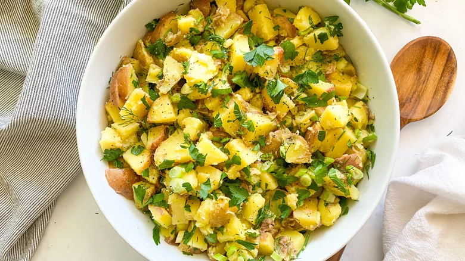

# :potato: French Potato Salad

| :fork_and_knife_with_plate: Serves | :timer_clock: Total Time |
|:----------------------------------:|:-----------------------: |
| 8 | 40 minutes |

## :salt: Ingredients

- :potato: 12 Yukon gold or red potatoes
- :herb: 0.5 cup parsley
- :herb: 0.25 cup dill
- :onion: 3 scallions
- :olive: 0.33 cup olive oil
- :sake: 3 Tbsp champagne vinegar
- :garlic: 1 clove garlic
- :hotdog: 1 Tbsp [Dijon mustard][1]
- :salt: 1 tsp salt
- :salt: 0.5 tsp pepper

## :cooking: Cookware

- 1 medium-sized pot
- 1 small bowl
- 1 large bowl

## :pencil: Instructions

### Step 1

Wash the Yukon gold or red potatoes and put them in a medium-sized pot. Cover the potatoes with water and boil them for
20 to 30 minutes, or until they're fork-tender.

### Step 2

While the potatoes are cooking, chop the parsley, dill, and scallions.

### Step 3

In a small bowl, mix the olive oil, champagne vinegar, crushed garlic, [Dijon mustard][1], salt, and pepper.

### Step 4

Let the potatoes cool for about 10 minutes then chop them up. Add them to a large bowl along with the parsley, dill, and
scallions, and toss with the dressing. Chill the potato salad in the fridge or serve at room temperature.

## :link: Source

- <https://www.tastingtable.com/821288/french-potato-salad-recipe/>

[1]: <../sauces-and-dressings/dijon-mustard.md>
