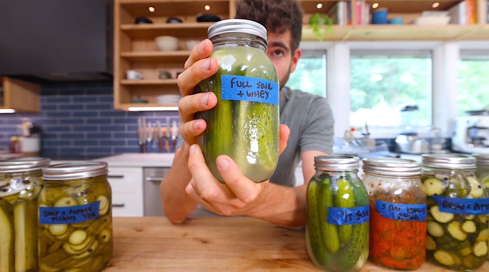

# Full Sour Pickles

{ loading=lazy }

| :fork_and_knife_with_plate: Serves | :timer_clock: Total Time |
|:----------------------------------:|:-----------------------: |
| 4 | 5.00 days |

## :salt: Ingredients

- :cucumber: 1 pound cucumbers
- :droplet: water (to fill)
- :salt: sea salt (5% of water weight in grams)

## :cooking: Cookware

- 1 mason jar
- 1 scale

## :pencil: Instructions

### Step 1

Cut the washed cucumbers (washed) how you want. I choose to cut them in half for this recipe. Pack them into a clean
mason jar.

### Step 2

Place the jar filled with the cucumbers on an electronic kitchen scale, and tare the scale so that it weighs zero.

### Step 3

Pour water all the way to the top and get the weight of the water in grams.

### Step 4

Multiply that weight by 0.05 to find the correct amount of sea salt you need in grams.

### Step 5

Tare the scale so it reads zero again and pour the predetermined amount of sea salt directly into the jar. Seal the jar
and shake so the salt will dissolve and disburse throughout the jar.

### Step 6

Label the jar and let ferment for 3 to 5 days at room temperature. Once done fermenting, place in the refrigerator and
enjoy!

## :link: Source

- <https://lifebymikeg.com/blogs/all/beginners-guide-to-pickling-cucumbers>
