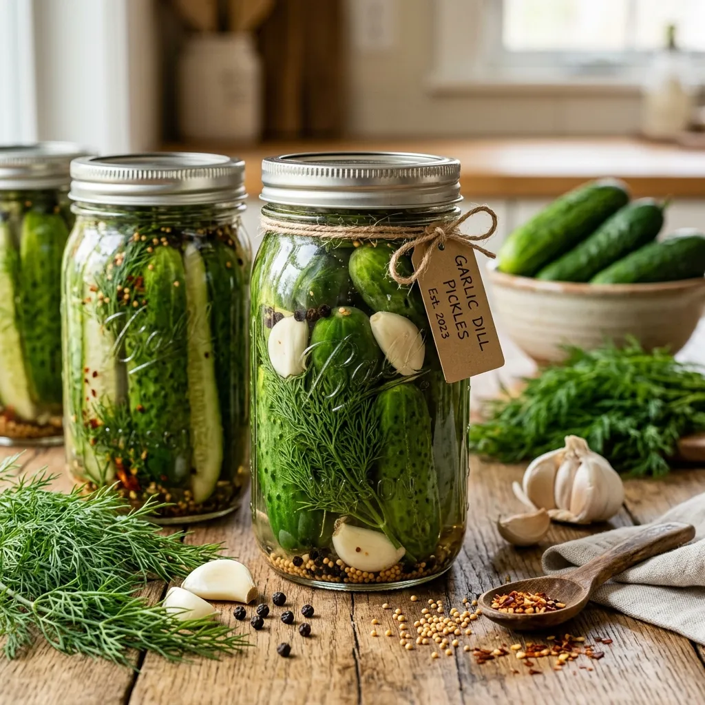

# Garlic Dill Pickles

{ loading=lazy }

| :timer_clock: Total Time |
|:-----------------------: |
| 0 minutes |

## :salt: Ingredients

- 16 cloves garlic
- 16 sprigs fresh dill
- 4 tsp whole black peppercorns
- 4 tsp mustard seeds
- 2 tsp red pepper flakes
- 64 oz Kirby or Persian cucumbers
- 4 cups water
- 4 cups white vinegar
- 0.25 cup Kosher salt
- 0.25 cup granulated sugar

## :cooking: Cookware

## :pencil: Instructions

### Step 1

Pack the garlic, fresh dill, whole black peppercorns, mustard seeds, and red pepper flakes evenly into your clean jars,
then tightly pack the Kirby or Persian cucumbers over them.

### Step 2

In a large pot, bring the water, white vinegar, Kosher salt, and granulated sugar to a simmer until the salt and sugar
dissolve.

### Step 3

Pour the hot brine over the cucumbers, leaving 1/2 inch of headspace at the top of each jar.

### Step 4

Let cool to room temperature, seal tightly, and refrigerate.

## :link: Source

- Garlic Dill Pickles
