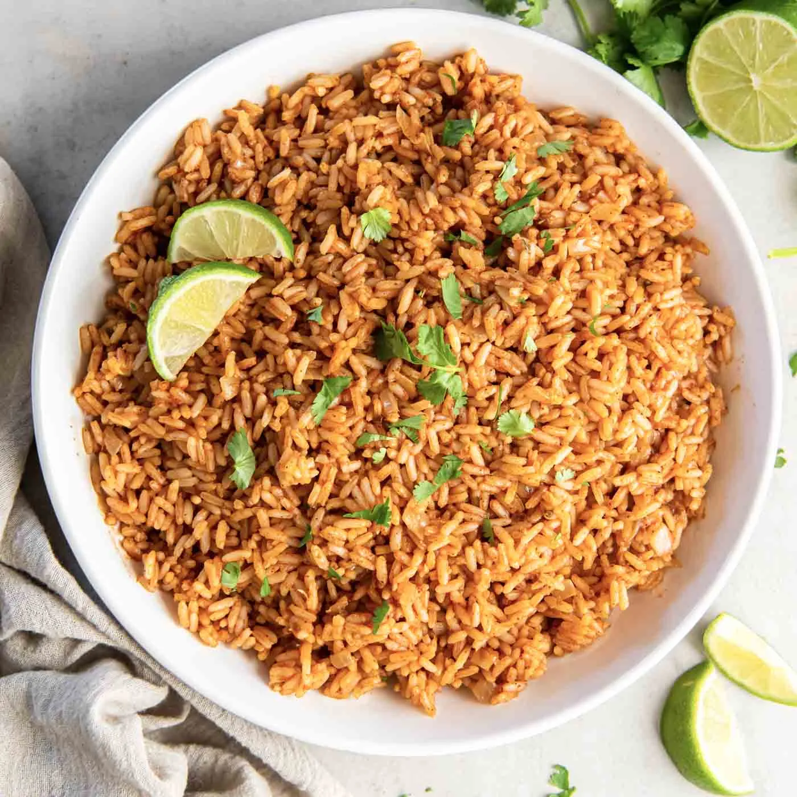

# :rice: Mexican Rice

{ loading=lazy }

| :fork_and_knife_with_plate: Serves | :timer_clock: Total Time |
|:----------------------------------:|:-----------------------: |
| 6 | 27 minutes |

## :salt: Ingredients

- :bread: 1.5 cups (297 g) long grain white rice
- :olive: 2 tablespoons (25 g) olive oil
- :beans: 1 cup (198 g) finely chopped white onion
- :garlic: 2 cloves garlic
- :stew: 2 cups low sodium chicken broth
- :apple: 8 ounces (232 g) tomato sauce
- :hot_pepper: 1 teaspoon (2 g) chili powder
- :chestnut: 0.5 teaspoon (2 g) ground cumin
- :herb: 0.5 teaspoon (1 g) dried oregano
- :salt: 0.75 teaspoon salt
- :apple: some chopped fresh cilantro (optional, for serving)
- :olive: 1 olive
- :baby_bottle: 1 garlic.
- :tomato: 1 tomato
- :hot_pepper: 1 chili
- :apple: 1 dried
- :baby_bottle: 1 salt.

## :cooking: Cookware

- 1 strainer
- 1 saucepan
- 1 pot
- 1 pot
- 1 pot

## :pencil: Instructions

### Step 1

long grain white rice

### Step 2

olive oil

### Step 3

finely chopped white onion (or yellow onion)

### Step 4

garlic (minced)

### Step 5

low sodium chicken broth (or vegetable broth)

### Step 6

tomato sauce

### Step 7

chili powder

### Step 8

ground cumin

### Step 9

dried oregano

### Step 10

salt (or to taste)

### Step 11

chopped fresh cilantro (optional, for serving)

### Step 12

In a fine mesh strainer, rinse the rice well and drain. Set aside.

### Step 13

In a large saucepan, heat the olive oil over medium-high heat. Add the onion and sauté until softened, 2 to 3 minutes.

### Step 14

Add the rinsed rice and minced garlic. Cook, stirring, until rice is toasted and fragrant, 3 to 4 minutes.

### Step 15

Add the chicken broth, tomato sauce, chili powder, cumin, dried oregano and salt. Stir.

### Step 16

Bring to a boil, then immediately reduce the heat to very low (you want the heat to be as low as it can go) and cover
the pot. Cook the rice, covered, for 15 to 20 minutes, stirring just once after the first 5 minutes of cook time. The
rice is done when the liquid has been absorbed. (This usually takes 15 minutes total cook time for me.)

### Step 17

Remove the pot from the heat and let the rice rest for 10 minutes without lifting the lid off of the pot.

### Step 18

Fluff rice and serve with chopped fresh cilantro, if desired.

## :link: Source

- <https://kristineskitchenblog.com/mexican-rice/>
