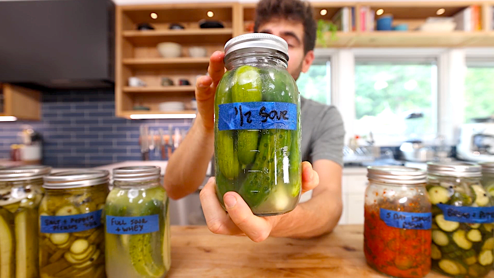

# Half Sour Pickles

{ loading=lazy }

| :fork_and_knife_with_plate: Serves | :timer_clock: Total Time |
|:----------------------------------:|:-----------------------: |
| 4 | 2.00 days |

## :salt: Ingredients

- :cucumber: 1.5 pounds cucumbers
- :droplet: water (to fill)
- :salt: sea salt (4% of water weight in grams)

## :cooking: Cookware

- 1 mason jar
- 1 scale

## :pencil: Instructions

### Step 1

Cut the washed cucumbers (1-2 pounds, washed) how you want, or keep them whole. Pack them into a clean mason jar.

### Step 2

Place the jar on an electronic kitchen scale, tare it to zero, and pour water all the way to the top. Note the weight of
the water in grams.

### Step 3

Multiply that weight by 0.04 to find the correct amount of sea salt needed in grams.

### Step 4

Tare the scale to zero again and pour the predetermined amount of sea salt directly into the jar. Seal the jar and shake
well so the salt dissolves and distributes throughout the jar.

### Step 5

Label the jar and let ferment for 1 to 2 days at room temperature. Once done fermenting, place in the refrigerator and
enjoy!

## :link: Source

- <https://lifebymikeg.com/blogs/all/beginners-guide-to-pickling-cucumbers>
