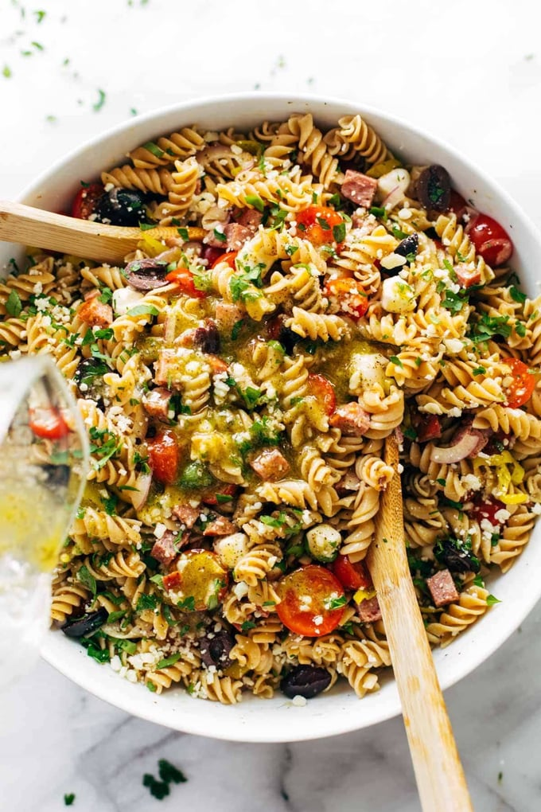

# :green_salad: Pasta Salad

| :timer_clock: Total Time |
|:-----------------------: |
| 20 minutes |

## :salt: Ingredients

- :spaghetti: 1 lb pasta salad pasta
- :garlic: some garlic salt
- :onion: some onion powder
- :salt: some salt
- :salt: some Italian seasoning
- :broccoli: 0.5 cup broccoli
- :olive: 2 Tbsp olives
- :tomato: 1 roasted tomato
- :onion: 0.5 red onion
- :garlic: 1 tsp garlic
- :cut_of_meat: some slices of salami or ham
- :cheese_wedge: some slices of provolone cheese
- :herb: 1 cruet Good Seasons Italian dressing

## :cooking: Cookware

## :pencil: Instructions

### Step 1

Boil pasta salad pasta.

### Step 2

Sprinkle garlic salt, onion powder, salt, and Italian seasoning on noodles while hot so that the flavor absorbs into the
noodles.

### Step 3

Add the broccoli, finely chopped olives, roasted tomato, red onion, crushed garlic, slices of salami or ham, slices of
provolone cheese mixing in the Good Seasons Italian dressing last. Then mix, toss and stir.

### Step 4

Leave in the refrigerator at least one hour before serving.

## :link: Source

- Tante Myrna Seccia
