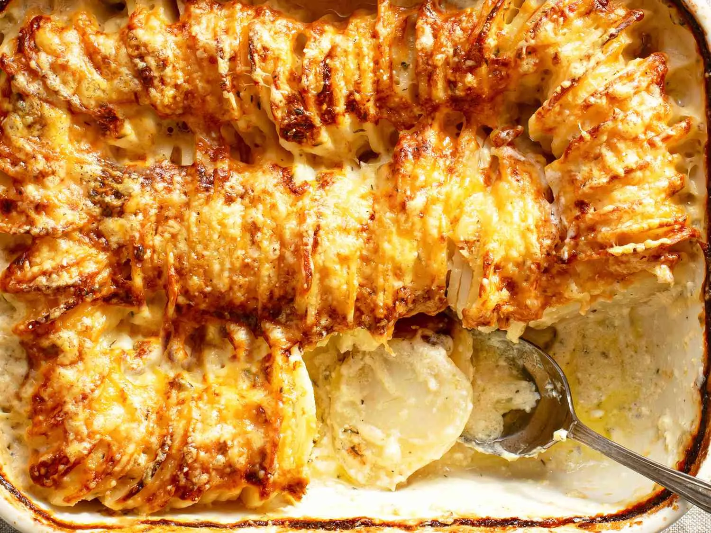

# :potato: Hasselback Potato Gratin

{ loading=lazy }

| :fork_and_knife_with_plate: Serves | :timer_clock: Total Time |
|:----------------------------------:|:-----------------------: |
| 6 | 1.83 hours |

## :salt: Ingredients

- :butter: 2 Tbsp (28 g) unsalted [butter](../../ingredients/butter/butter.md)
- :cheese_wedge: 3 oz (85 g) Gruyère cheese
- :cheese_wedge: 2 oz (57 g) Parmigiano-Reggiano cheese
- :glass_of_milk: 2 cups (454 g) heavy cream
- :herb: 1 Tbsp fresh thyme leaves
- :garlic: 2 cloves garlic
- :salt: kosher salt
- :salt: freshly ground black pepper
- :potato: 3 to 3 1/2 lbs russet potatoes, peeled and sliced 1/8-inch thick on a mandoline

## :cooking: Cookware

- 1 2-quart baking dish
- 1 large bowl
- 1 separate bowl
- 1 aluminum foil

## :pencil: Instructions

### Step 1

Adjust oven rack to middle position and preheat oven to 400 °F (205°C). Grease a 2-quart baking dish with unsalted
[butter](../../ingredients/butter/butter.md). Combine finely grated Gruyère cheese (or Comté) and finely grated
Parmigiano-Reggiano cheese in a large bowl. Transfer 1/3 of the cheese mixture to a separate bowl and set aside.
Add heavy cream, roughly chopped fresh thyme leaves, and minced garlic to the first bowl of cheese mixture. Season
generously with kosher salt and freshly ground black pepper. Add peeled russet potatoes, peeled and sliced 1/8-inch
thick on a mandoline and toss with hands until every slice is coated with cream mixture, separating any slices sticking
together so the cream mixture gets between them.

### Step 2

Pick up a handful of potatoes, organizing them into a neat stack, and lay them in the prepared baking dish with their
edges aligned vertically. Continue placing potatoes in the dish, working around the perimeter and into the center
until all potatoes have been added. Potatoes should be very tightly packed. If necessary, slice additional potatoes,
coat slices with cream mixture, and add to the dish. Pour excess cream and cheese mixture evenly over the potatoes until
the mixture comes halfway up the sides of the dish.

### Step 3

Cover tightly with aluminum foil and transfer to oven. Bake for 30 minutes. Remove foil and continue baking until the
top is pale golden brown, about 30 minutes longer. Carefully remove from oven, sprinkle with the reserved cheese
mixture, and return to oven. Bake until deep golden brown and crisp on top, about 30 minutes longer. Remove from oven,
let rest for a few minutes, and serve.

## :link: Source

- [Serious Eats][1]

<!-- Link References -->
[1]: https://www.seriouseats.com/hasselback-potato-gratin-casserole-holiday-food-lab
