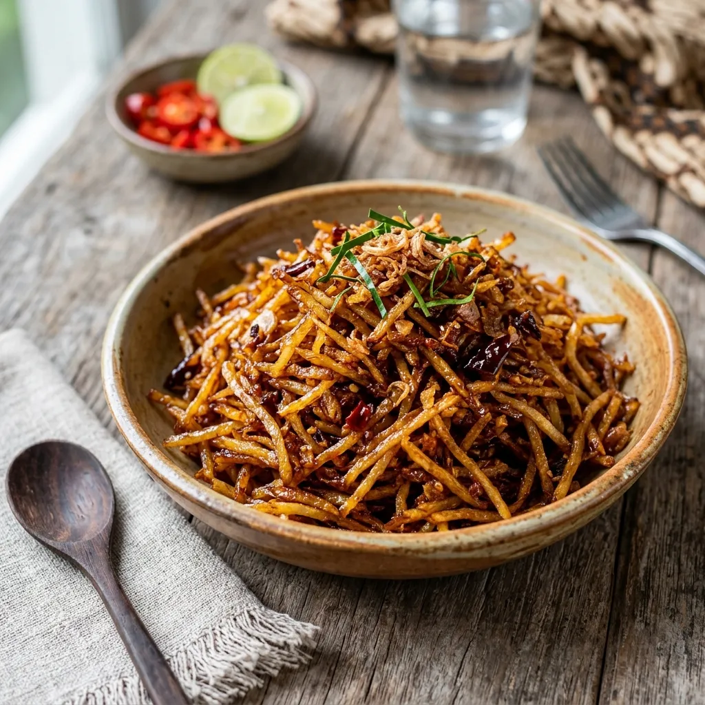

# :potato: Sambal Goreng Kering Kentang

{ loading=lazy }

| :fork_and_knife_with_plate: Serves | :timer_clock: Total Time |
|:----------------------------------:|:-----------------------: |
| 4 | 1 hour |

## :salt: Ingredients

- :apple: 500 g potatoes, peeled and julienned or finely grated
- :carrot: 2 cups (396 g) oil (for frying)
- :garlic: 3 shallots, thinly sliced
- :garlic: 2 cloves garlic, minced
- 1 Tbsp [Sambal Oelek](../../sauces-and-dressings/gravy-and-savory-sauces/sambal-oelek.md)
- 1/2 tsp [Vegetarian Terasi](../../ingredients/vegetarian-terasi.md)
- :baby_bottle: 1 Tbsp (20 g) tamarind paste (dissolved in 2 Tbsp water)
- :candy: 2 Tbsp (19 g) palm sugar (or coconut sugar)
- :salt: 1/2 tsp salt
- :herb: 2 daun salam (Indonesian bay leaves)
- :herb: 2 lime leaves, thinly sliced
- :droplet: 1 Tbsp (12 g) oil (for sauce)

## :cooking: Cookware

- 1 wok
- paper towels
- 1 baking sheet
- 1 airtight container

## :pencil: Instructions

### Step 1

Peel and julienne or finely grate the **potatoes**. Rinse under cold water to remove excess starch, then squeeze completely dry in a clean kitchen towel.

### Step 2

Heat 2 cups of **oil** in a wok over medium-high heat. Fry the potatoes in batches until golden brown and crispy, about 3 to 4 minutes per batch. Remove and drain on paper towels.

### Step 3

In a clean wok, heat 1 Tbsp **oil** over medium heat. Sauté the **shallots** and **garlic** until fragrant and golden.

### Step 4

Add the **[Sambal Oelek](../../sauces-and-dressings/gravy-and-savory-sauces/sambal-oelek.md)** and **[Vegetarian Terasi](../../ingredients/vegetarian-terasi.md)** and cook for 1 minute, stirring well.

### Step 5

Stir in the **tamarind paste**, **palm sugar**, and **salt**. Add the **daun salam** and **lime leaves**. Cook over medium-low heat, stirring, until the sauce thickens into a syrup, about 3 to 5 minutes.

### Step 6

Turn off the heat. Add the fried potatoes to the wok and toss quickly until every strand is evenly coated.

### Step 7

Spread out on a baking sheet and allow to cool completely. The coating will set and the potatoes will crisp up further as they cool.

### Step 8

Serve at room temperature. Store leftovers in an airtight container at room temperature.

## :link: Source

- *Indo Dutch Kitchen Secrets* by Jeff Kesberry ([GitHub Issue #1366](https://github.com/nicholaswilde/recipes/issues/1366))
