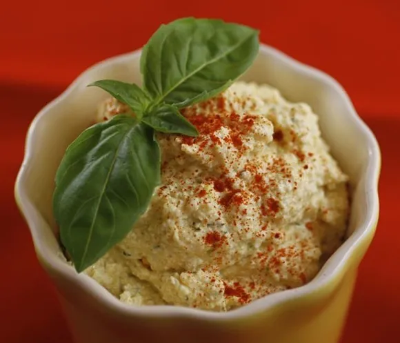

---
tags:

  - sides
comments: true

hero: assets/images/eggless-egg-salad.webp
---

# Eggless Egg Salad

{ loading=lazy }

| :timer_clock: Total Time |
|:-----------------------: |
| 0 minutes |

## :salt: Ingredients

- :cheese_wedge: 1 pkg firm tofu
- :leafy_green: 0.5 stalk celery plug leaves
- :garlic: 1 clove shallot
- :herb: 0.25 tsp dry dill
- :herb: 0.5 tsp fresh dill
- :curry: 0.5 tsp turmeric
- :seedling: 1 tsp Dijon mustard
- :cucumber: 2 tsp dill pickle relish
- :onion: 0.25 tsp onion powder
- :garlic: 0.25 tsp garlic powder
- :baby_bottle: 0.25 cup [mayonnaise][1]
- :salt: some sea salt
- :curry: some turmeric

## :cooking: Cookware

- 1 food processor

## :pencil: Instructions

### Step 1

Put one-quarter of the block of firm tofu in a food processor with celery plug leaves, shallot, dry dill, fresh dill,
turmeric, Dijon mustard, dill pickle relish, onion powder, garlic powder, and mayonnaise. Blend until combined.

### Step 2

Add the remaining three-quarter block of tofu and pulse until mixed but not smooth, keeping a course texture. Taste.
Adjust ingredients and sea salt to your liking. Add more turmeric if it needs more authentic egg salad color.

## :link: Source

- <https://www.tastewiththeeyes.com/2010/01/eggless-egg-salad/>

[1]: <../../sauces-and-dressings/dips-and-spreads/mayonnaise.md>
