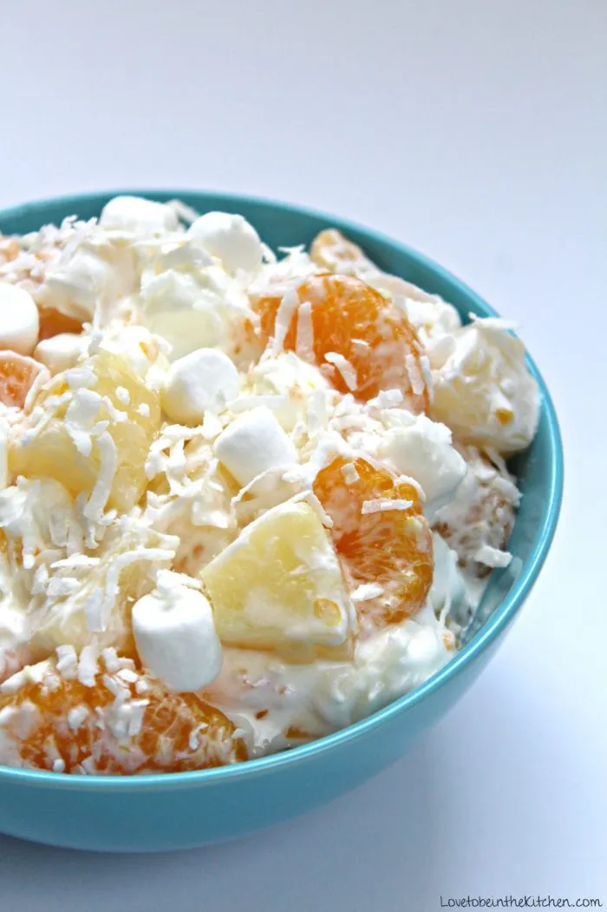

# :pineapple: Five-Cup Fruit Salad

{ loading=lazy }

| :timer_clock: Total Time |
|:-----------------------: |
| 5 minutes |

## :salt: Ingredients

- :pineapple: 1 medium can pineapple tidbits (drained)
- :tangerine: 1 small can mandarin oranges
- :tea: 1 cup (43 g) small marshmallows
- :coconut: 1 cup (226 g) coconut
- :glass_of_milk: 1 cup (227 g) sour cream

## :pencil: Instructions

### Step 1

Mix pineapple tidbits (drained), mandarin oranges, small marshmallows, coconut, and sour cream.

### Step 2

Chill overnight.

!!! note

    Fruit cocktail, well drained, may also be added.
