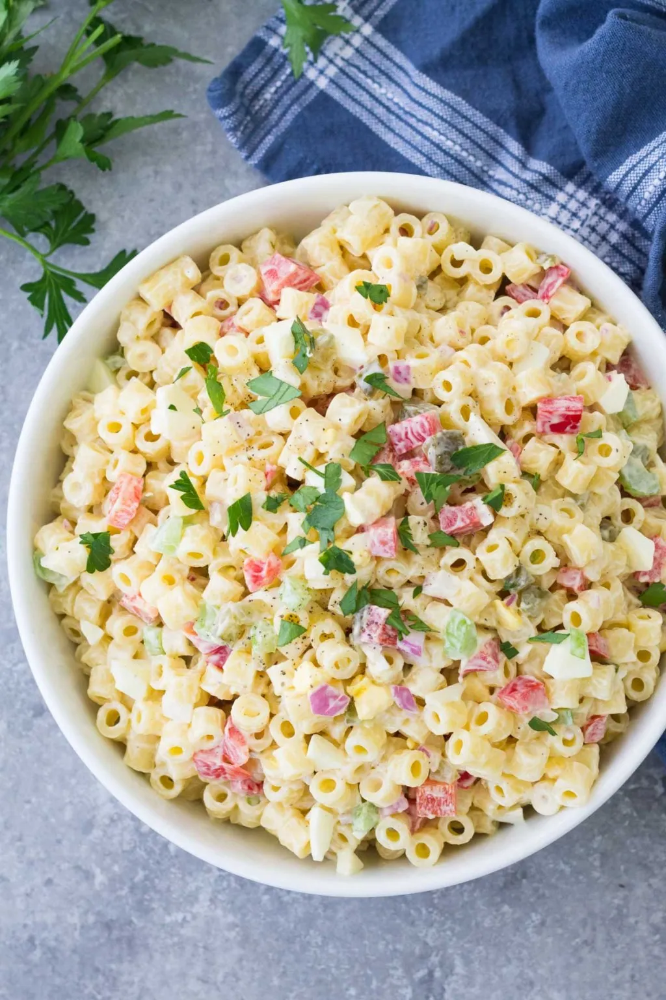

# :green_salad: Macaroni Salad

tags:

- sides

{ loading=lazy }

| :timer_clock: Total Time |
|:-----------------------: |
| 30 minutes |

## :salt: Ingredients

- :egg: 4 eggs
- :stew: 1 chicken breast
- 1 bag macaroni noodles
- :salt: 1 tsp salt
- :garlic: 0.5 tsp garlic powder
- :chestnut: 0.75 tsp (2 g) onion powder
- :salt: 0.5 tsp salt
- :salt: 0.5 tsp pepper
- :tea: 0.5 onion
- :leafy_green: 2 stalks celery
- :tangerine: 0.25 cup pickle relish
- 1 cup [mayonnaise][1]
- :seedling: 0.5 tsp mustard
- :baby_bottle: some Lawry's seasoned salt

## :cooking: Cookware

- 1 large soup stock pan

## :pencil: Instructions

### Step 1

Boil eggs until done.

### Step 2

Boil chicken breast in a large soup stock pan until soft and tender.

### Step 3

Take chicken breast out and pour macaroni noodles into the chicken stock with 1 tsp salt until done.

### Step 4

Shred chicken breast.

### Step 5

While noodles are warm, pour garlic powder, onion powder, 1/2 tsp salt, and pepper over noodles, mix and stir.

### Step 6

Then add chopped onion, chopped celery, pickle relish, mayonnaise, and mustard in order given.

### Step 7

Chill overnight add more mayo if noodles are too dry. Salad needs to be creamy. Top with Lawry's seasoned salt.

### Step 8

Enjoy!

## :link: Source

- Tante Myrna Seccia

[1]: <../../sauces-and-dressings/dips-and-spreads/mayonnaise.md>
