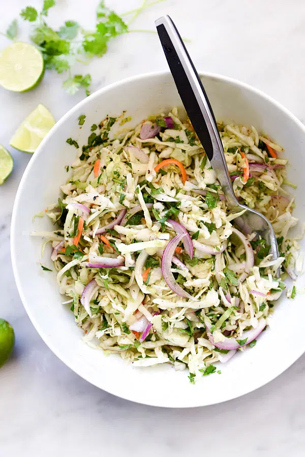

---
tags:

  - sides
comments: true

---

# Mexican Coleslaw

{ loading=lazy }

| :timer_clock: Total Time |
|:-----------------------: |
| 10 minutes |

## :salt: Ingredients

- :leafy_green: 1 head cabbage
- :onion: 1 red onion
- :herb: 1 bunch cilantro
- :olive: 0.5 cup (100 g) olive oil
- :champagne: 0.17 cup white vinegar
- :apple: 0.17 cup apple cider vinegar
- :candy: 0.75 cup (148 g) sugar
- :salt: 0.5 tsp pepper
- :salt: 2 tsp salt

## :pencil: Instructions

### Step 1

For the slaw, combine cabbage, red onion, and cilantro.

### Step 2

For the dressing, combine olive oil, white vinegar, apple cider vinegar, sugar, pepper, and salt.
