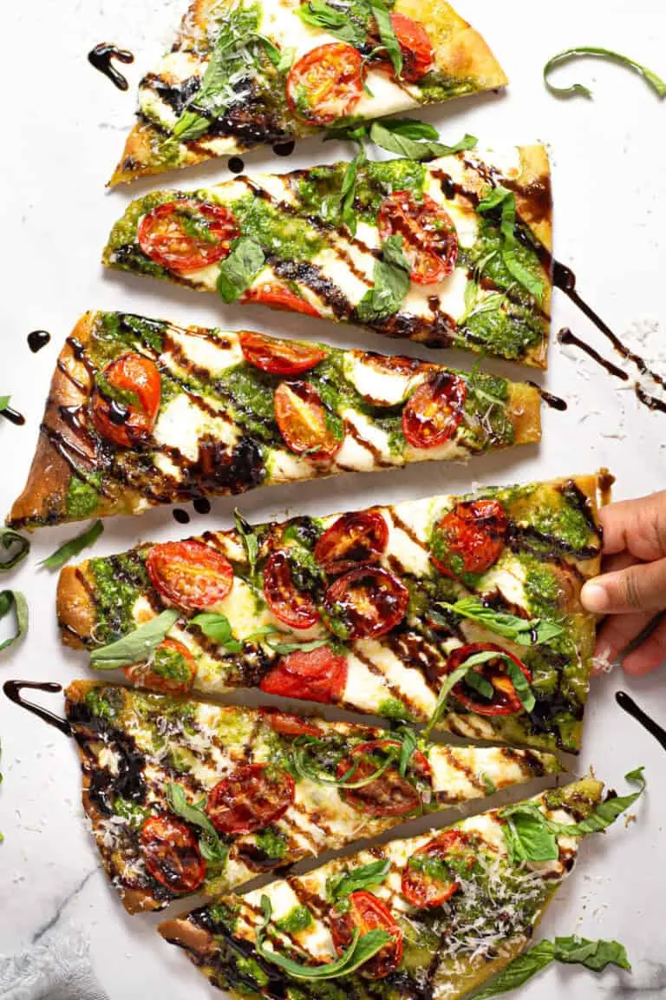

# :flatbread: Caprese Flatbread

{ loading=lazy }

| :fork_and_knife_with_plate: Serves | :timer_clock: Total Time |
|:----------------------------------:|:-----------------------: |
| 4 | 8 minutes |

## :salt: Ingredients

- 2 large flatbread or [naan][2]
- 0.5 cup [Balsamic Pesto][1]
- :cheese_wedge: 8 oz (113 g) mozzarella
- :tea: 1 cup (170 g) red and/or yellow cherry or grape tomatoes
- :herb: some basil
- :apple: some balsamic glaze (optional)
- :salt: some flaky sea salt

## :cooking: Cookware

- 1 large baking sheet

## :pencil: Instructions

### Step 1

Preheat oven to 425°F.

### Step 2

Place flatbread or [naan][2] on a large baking sheet.

### Step 3

Spread each with 1/4 cup [Balsamic Pesto][1].

### Step 4

Top with mozzarella and red and/or yellow cherry or grape tomatoes, halved.

### Step 5

Use the baking sheet to transfer flatbread directly to the oven rack. Bake 6 to 8 minutes or until crust is golden and
cheese is melted.

### Step 6

Remove from oven. Top with basil and, if you like, drizzle with balsamic glaze (optional). Sprinkle with flaky sea salt.

## :link: Source

- Magnolia

[1]: <../../sauces-and-dressings/gravy-and-savory-sauces/pesto/balsamic-pesto.md>
[2]: <../../breads/naan.md>
