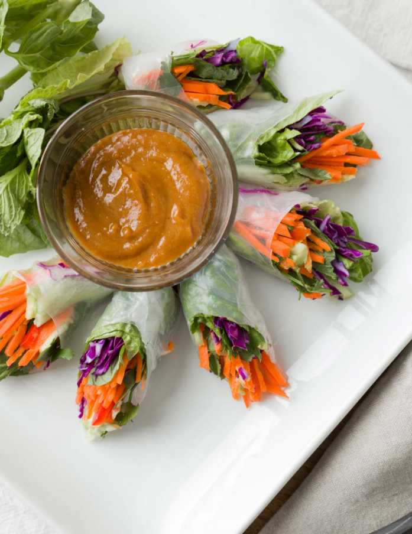

# :burrito: Fresh Spring Rolls

{ loading=lazy }

| :fork_and_knife_with_plate: Serves | :timer_clock: Total Time |
|:----------------------------------:|:-----------------------: |
| 8 | 30 minutes |

## :salt: Ingredients

=== "Peanut Sauce"

    - :chestnut: 0.25 cup (68 g) creamy peanut butter
    - :takeout_box: 4 tsp (12 g) soy sauce
    - :tangerine: 1 Tbsp (14 g) lime juice
    - :maple_leaf: 2 tsp (9 g) brown sugar
    - :garlic: 1 tsp chili garlic sauce
    - :salt: 1 tsp (5 g) freshly ground ginger
    - :droplet: 2 Tbsp (28 g) water

=== "Spring Rolls"

    - :bread: 8 rice paper wrapper
    - :cheese_wedge: 0.5 head lettuce
    - :shamrock: 0.75 cup mint
    - :herb: 0.75 cup (32 g) cilantro
    - 1 cup carrots[^1]
    - 0.5 head purple cabbage
    - :hot_pepper: 1 red bell pepper[^1]
    - 0.5 cucumber[^1]
    - :avocado: 1 avocado
    - :salt: some salt
    - :salt: some pepper
    - 1 [peanut dipping sauce][1]

## :cooking: Cookware

- 1 small bowl
- 1 cutting board

## :pencil: Instructions

### Step 1

To make the peanut sauce, whisk creamy peanut butter, soy sauce, lime juice, brown sugar, chili garlic sauce, and
freshly ground ginger in a small bowl. Whisk in 2 tablespoons of water until desired consistency is reached.

### Step 2

Wet each rice paper wrapper individually for 10 to 15 seconds and place it on a cutting board. Place lettuce, mint, and
cilantro in the center of each wrapper. Top with carrots, purple cabbage, red bell pepper, cucumber and avocado. Season
with light salt and pepper to taste.

### Step 3

Bring the bottom edge of the wrap tightly over the filling, fold in the sides, then roll from bottom to top until the
top of the sheet is reached. Be careful not to tear the rice paper. Cover the roll with damp paper towels. Repeat with
remaining wrappers and filling.

### Step 4

Serve with [peanut dipping sauce][1] and enjoy!

## :link: Source

- Applied Kitchen

[^1]:
  Thinly sliced into long matchsticks.

[1]: <../../sauces-and-dressings/gravy-and-savory-sauces/peanut-dipping-sauce.md>
