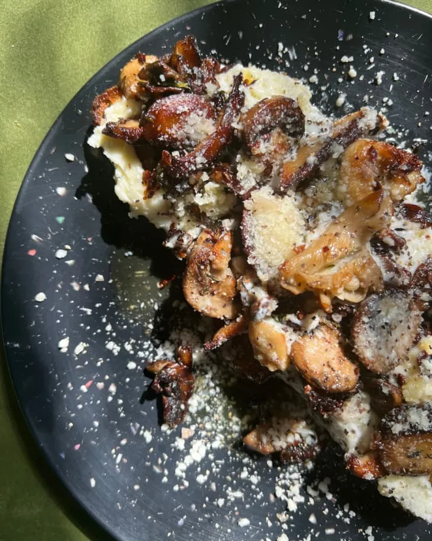

---
tags:

  - sides
comments: true

hero: assets/images/josh-elkin's-mushroom-toast.webp
---

# :butter: Josh Elkin's Mushroom Toast

{ loading=lazy }

| :fork_and_knife_with_plate: Serves | :timer_clock: Total Time |
|:----------------------------------:|:-----------------------: |
| 2 | 0 minutes |

## :salt: Ingredients

- :butter: 0.25 cup Butter
- :olive: 1 Tbsp (12 g) olive oil
- 1 cup (156 g) sliced shallots
- :garlic: 2 cloves garlic
- :mushroom: 2 cups (156 g) porcini mushrooms
- :salt: some salt
- :salt: some pepper
- :herb: 2 Tbsp thyme
- :monkey_face: 4 thick slices crusty bread
- :cheese_wedge: 1 cup (227 g) mascarpone cheese
- :salt: some salt
- :salt: some pepper
- :herb: 2 Tbsp thyme
- :salt: some flaky salt
- :cheese_wedge: 2 Tbsp (12 g) Parmesan

## :cooking: Cookware

- 1 pan

## :pencil: Instructions

### Step 1

Butter and olive oil are melted in a pan, then sliced shallots and garlic get sautéed until they start to get a little
soft. Next, you add your thinly sliced porcini mushrooms and season them with a little salt, pepper, and thyme. I
couldn’t get my hands on fresh porcini mushrooms so I used baby bella mushrooms instead.

### Step 2

While all of this is cooking on the stove, toast up two thick slices of crusty bread. My preference is a yummy sourdough
boule, but feel free to go with what you’d like! You’ll also need to whisk up some softened mascarpone cheese with a
bit of olive oil, salt, and pepper. Once your bread is crunchy, your mushrooms are flavorful, and your mascarpone is
seasoned, spread the cheese onto the bread, top with the sautéed mushrooms, and sprinkle with some thyme, flaky salt,
and grated Parmesan.

## :link: Source

- <https://www.thekitchn.com/mushroom-toast-recipe-review-23389923>
